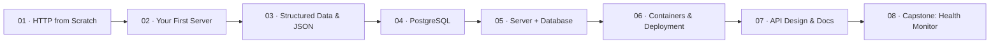

# Backend

Everything behind the scenes. This track takes you from "what even is HTTP" to a deployed, containerized Go service with a real database, background workers, and scheduled jobs.

**Prerequisite:** [Getting Started — Go variant](../getting-started/variant-go/)

Go is the only language in this track. You learned it in Getting Started; now you build real infrastructure with it.

## The approach

We start at the bottom: what actually happens when your browser sends a request. You'll read raw HTTP with `curl` before you ever write a handler. Then you'll build a server, learn how data moves as JSON, connect it to PostgreSQL, containerize it with Docker, and design a proper API.

Each module adds exactly one new concept. By Module 07 you've built, stored, containerized, and documented a real service. The capstone ties it together with something harder — a site health monitor with goroutines, channels, cron jobs, and background workers. Not just CRUD.

## The roadmap

## Module overview

| # | Module | What clicks |
|---|--------|------------|
| 01 | HTTP from Scratch | Every web interaction is a text message with a verb, a path, and a body |
| 02 | Your First Server | A server is a loop that reads requests and writes responses. That's it. |
| 03 | Structured Data & JSON | The contract between client and server is just agreed-upon data shapes |
| 04 | PostgreSQL | A relational database is a spreadsheet with superpowers — constraints, joins, and transactions |
| 05 | Server + Database | The server validates, transforms, and persists. In that order. |
| 06 | Containers & Deployment | Docker means your code runs the same on your machine as it does on mine. Forever. |
| 07 | API Design & Docs | A good API teaches its consumers how to use it. A bad one requires a phone call. |
| 08 | Capstone: Site Health Monitor | You build a service with background workers, scheduled jobs, and real concurrency |

## Capstone: Site health monitor

A service that monitors URLs for uptime. You register URLs to watch, and the service pings them on a schedule and tracks their response times.

What makes this more than CRUD:

- **Goroutine worker pool** — pings URLs concurrently on their configured schedule
- **Cron job** — nightly aggregation of response times, cleanup of old data
- **Channels** — coordinate between HTTP handlers and the worker pool
- **Alerting** — logs when a site goes from up to down (and back)
- **Time-series storage** — `check_results` table with pagination on the history endpoint

The API:
- `POST /monitors` — register a URL with a check interval
- `GET /monitors` — list all monitors with current status (up / down / degraded)
- `GET /monitors/{id}/history` — paginated response time history

Dockerized with compose (API + PostgreSQL), deployed to a live URL. You can point it at your own projects.

## Resources

**Go**
- [ThePrimeagen — HTMX & Go](https://theprimeagen.github.io/fem-htmx/) — the Go server sections (skip the HTMX parts)
- [Melkey — Go Project (FEM)](https://github.com/Melkeydev/fem-project-live) — building a real Go project from scratch
- [Roadmap.sh — Go](https://roadmap.sh/golang) — full Go learning path

**SQL & databases**
- [Brian Holt — SQL](https://sql.holt.courses/) — SQL taught practically
- [Roadmap.sh — PostgreSQL](https://roadmap.sh/postgresql-dba) — PostgreSQL learning path

**Containers**
- [Brian Holt — Containers v2](https://containers-v2.holt.courses/) — Docker and containers from the ground up
- [Roadmap.sh — Docker](https://roadmap.sh/docker) — Docker learning path

**HTTP & API design**
- [MDN — HTTP overview](https://developer.mozilla.org/en-US/docs/Web/HTTP/Overview)
- [Roadmap.sh — Backend](https://roadmap.sh/backend) — the big picture of backend development

**Systems context**
- [ByteByteGo — Scale from Zero to Millions](https://bytebytego.com/) — ch. 2 of the System Design Interview book, covers the foundations of everything in this track
