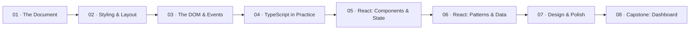

# Frontend

Everything the user sees and touches. This track takes you from raw HTML to a deployed React application.

**Prerequisite:** [Getting Started — TypeScript variant](../getting-started/variant-ts/)

TypeScript is the only language in this track. You learned it in Getting Started; now you put it to work.

## The approach

We start with the document — what a web page actually is before any framework touches it. Then styling, then interactivity with plain JavaScript and the DOM. You'll feel the friction of managing state by hand. That friction is the point — when React shows up in Module 05, you'll understand exactly what problem it solves and why.

The track ends with design and polish. Spacing, motion, and accessibility aren't afterthoughts you bolt on later. They're engineering problems with engineering solutions.

## The roadmap

## Module overview

| # | Module | What clicks |
|---|--------|------------|
| 01 | The Document | A web page is a tree of boxes, and you can inspect every one |
| 02 | Styling & Layout | CSS is a constraint system — you describe what you want, the browser figures out how |
| 03 | The DOM & Events | JavaScript makes the document alive. React will make this easier soon. |
| 04 | TypeScript in Practice | Types catch mistakes before the browser ever runs your code |
| 05 | React: Components & State | UI is a function of state. When state changes, the screen updates. That's the whole model. |
| 06 | React: Patterns & Data | Real apps fetch data, handle loading states, and compose components — React has patterns for all of it |
| 07 | Design & Polish | Spacing, motion, and accessibility are engineering problems, not art problems |
| 08 | Capstone: Personal Dashboard | You ship a polished web app you'd actually use, deployed to a live URL |

## Capstone: Personal dashboard

Build a dashboard that pulls from 2–3 public APIs — weather, GitHub activity, news, whatever you actually care about. Typed data fetching, multiple routes, loading and error states, responsive layout, accessible markup, at least one meaningful animation. Deployed to Vercel (or similar) with a URL you can share.

## Resources

These show up in individual modules. Here's the full list for reference.

**TypeScript**
- [Anjana Vakil — TypeScript First Steps](https://anjana.dev/typescript-first-steps/)
- [Mike North — TypeScript Fundamentals v4](https://www.typescript-training.com/course/fundamentals-v4)
- [Mike North — Domain Modeling with TypeScript](https://www.typescript-training.com/course/domain-modeling-with-ts)

**JavaScript foundations**
- [Will Sentance — JavaScript: The Hard Parts v3](https://frontendmasters.com/courses/javascript-hard-parts-v3/) — execution context, closures, and higher-order functions from first principles

**React**
- [React — Quick Start](https://react.dev/learn) — the official docs are actually good
- [TanStack Query](https://tanstack.com/query/latest) — data fetching done right

**HTML & CSS**
- [MDN — HTML elements reference](https://developer.mozilla.org/en-US/docs/Web/HTML/Element)
- [MDN — CSS layout](https://developer.mozilla.org/en-US/docs/Learn/CSS/CSS_layout)
- [MDN — Introduction to events](https://developer.mozilla.org/en-US/docs/Learn/JavaScript/Building_blocks/Events)

**Design reference**
- [Roadmap.sh — Frontend](https://roadmap.sh/frontend) — the big picture of everything in the frontend world
- [Roadmap.sh — React](https://roadmap.sh/react) — React-specific learning path
- [Roadmap.sh — TypeScript](https://roadmap.sh/typescript) — TypeScript learning path
