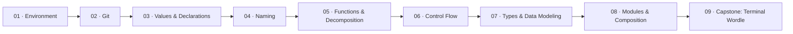

# Getting Started

This is where everyone begins. Before you touch React, before you write a server, before you design a system — you learn how to think about code.

Two variants, same ideas. Pick the language that matches where you're headed:

- **[Go variant](variant-go/)** — if you're interested in the Backend track
- **[TypeScript variant](variant-ts/)** — if you're interested in the Frontend track

Both variants cover the same concepts in the same order. The only difference is the language you write. If you finish one variant and want to try the other, it'll go fast — the thinking is the same, only the syntax changes.

## What you'll learn

Not syntax. Thinking.

How to name things so your code reads like prose. How to break problems into pieces small enough to hold in your head. How to make bad states impossible instead of checking for them everywhere. How to organize code so you can change one thing without breaking everything else.

These nine modules build on each other. Each one gives you a tool that the next module puts to work.

## The roadmap

## Module overview

| # | Module | What clicks |
|---|--------|------------|
| 01 | Environment | Your machine is ready and you know where everything lives |
| 02 | Git | You can track changes, work in parallel, and fix your mistakes |
| 03 | Values & Declarations | You know what data is — variables, constants, expressions, statements |
| 04 | Naming | The hardest part of programming is choosing the right word |
| 05 | Functions & Decomposition | You can break any problem into pieces and know what a side effect is |
| 06 | Control Flow | Flat code beats clever code, and you know why |
| 07 | Types & Data Modeling | You can make bad states impossible, and you know when FP vs OOP fits |
| 08 | Modules & Composition | You can organize files, draw boundaries, and hide complexity |
| 09 | Capstone: Terminal Wordle | You can build a real thing from scratch using everything above |

## How long this takes

Each module has 2–4 exercises. Most exercises take 15–30 minutes. The capstone takes a couple of hours. At one club meeting per week, this track fills a semester.

## After Getting Started

Once you finish, pick your track:

- **[Frontend](../frontend/)** (requires TypeScript variant) — HTML, CSS, React, design thinking
- **[Backend](../backend/)** (requires Go variant) — servers, PostgreSQL, Docker, API design
- **[Systems Engineering](../systems-engineering/)** (either variant) — scale, distributed systems, system design

## Resources

These are referenced throughout the modules. You don't need to read them upfront.

- [ThePrimeagen — Everything You'll Need to Know About Git](https://theprimeagen.github.io/fem-git/) — the best Git course out there
- [MIT — The Missing Semester](https://missing.csail.mit.edu/) — the practical skills CS programs skip
- [ThePrimeagen — The Last Algorithms Course You'll Need](https://theprimeagen.github.io/fem-algos/) — algorithms taught for understanding, not memorization
- [Brian Holt — Complete Intro to Computer Science](https://btholt.github.io/complete-intro-to-computer-science/) — CS fundamentals without the academic overhead
