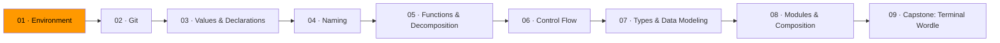

# 01 · Environment

Programming happens in a few places: an editor where you write code, a terminal where you run it, and a version control system that tracks what you changed. Before you write a single line of Go, you need all three working.

This module is short on purpose. The goal is to get set up and verify everything works, not to become a terminal wizard.

## What you'll install

**VS Code** — a code editor. You'll live here. It has a Go extension that catches errors as you type, formats your code automatically, and lets you run programs without leaving the editor.

**Go** — the language runtime. When you write a `.go` file, the `go` command compiles and runs it. Go compiles fast enough that you won't notice the compilation step.

**Git** — version control. Tracks every change you make so you can undo mistakes, work on features in parallel, and collaborate without stepping on each other. Module 02 covers Git in depth. For now, you just need it installed.

**GitHub CLI (`gh`)** — a command-line tool for working with GitHub. Create repos, open pull requests, and manage issues without opening a browser.

## The terminal

The terminal is a text interface to your computer. Everything you can do by clicking around in Finder or File Explorer, you can do faster by typing commands.

You don't need to memorize much. These five commands cover 90% of what you'll do:

| Command | What it does |
|---------|-------------|
| `ls` | List files in the current directory |
| `cd` | Change directory (`cd projects`, `cd ..` to go up) |
| `mkdir` | Create a directory |
| `cat` | Print a file's contents |
| `go run .` | Compile and run the Go program in the current directory |

On Windows, use Git Bash (it comes with Git) instead of Command Prompt or PowerShell. The commands above work the same way.

## Exercises

1. **[Toolbox check](exercise-01-toolbox-check/)** — install everything and verify it works
2. **[First push](exercise-02-first-push/)** — create a repo, write a program, push it to GitHub

## Resources

- [MIT — The Missing Semester: The Shell](https://missing.csail.mit.edu/2020/course-shell/) — if you want to understand the terminal more deeply
- [Go — Download and install](https://go.dev/doc/install) — official installation guide
- [VS Code — Go extension](https://marketplace.visualstudio.com/items?itemName=golang.Go) — the extension that makes VS Code understand Go
