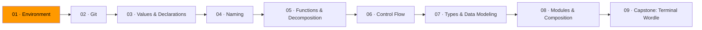
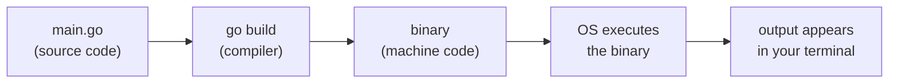

# 01 · Environment

*This is where it starts. Before you write code, you need a machine that can run it.*

You install Go. You install VS Code. You type `go run .` and your program runs. That covers 90% of your day. But when something breaks — and it will — the fix is almost always: the tool isn't installed, or your shell can't find it. Understanding the pipeline saves you hours of confused Googling.

## What happens when you type `go run .`

1. The shell hands `go run .` to the `go` program.
2. Go reads every `.go` file in the current directory, checks for errors, compiles it into a temporary binary.
3. The OS runs that binary. Output flows to your terminal.

`go run` is shorthand for `go build` + execute. The compilation still happens. Go just does it fast enough to feel instant. This pipeline is the same in C, Rust, and Zig. Different compiler, same structure.

## Three things to understand

**The shell** reads your commands, finds programs, runs them. Five commands cover daily use:

| Command | What it does |
|---------|-------------|
| `ls` | List files in the current directory |
| `cd` | Change directory |
| `mkdir` | Create a directory |
| `cat` | Print a file's contents |
| `go run .` | Compile and run the Go program here |

**The PATH** is a list of directories your shell searches when you type a command. If `go` isn't in one of those directories, you get `command not found`. Every "installation" is really two things: putting a binary on disk and making sure its location is in `PATH`. When an install "doesn't work," the problem is almost always `PATH`.

**The editor** is VS Code with the Go extension. The extension runs `gopls` (Go's language server) in the background, giving you errors, formatting, and autocomplete. The editor and the language server are separate programs. Small tools, clear boundaries.

## Go toolchain

| Command | What it does |
|---------|-------------|
| `go run .` | Compile and run the current directory |
| `go build .` | Compile into a binary without running |
| `go mod init` | Initialize a new module (project) |
| `go fmt ./...` | Format all Go files |
| `go test ./...` | Run all tests |

Go compiles to a static binary. No runtime, no VM, no interpreter. One file. You run it.

## Exercises

1. **[Toolbox check](exercise-01-toolbox-check/)** — install everything and verify it works
2. **[First push](exercise-02-first-push/)** — create a repo, write a program, push it to GitHub

## Resources

- [MIT — The Missing Semester: The Shell](https://missing.csail.mit.edu/2020/course-shell/) — the lecture this module draws from
- [Go — Download and install](https://go.dev/doc/install) — official installation guide
- [VS Code — Go extension](https://marketplace.visualstudio.com/items?itemName=golang.Go) — the extension that makes VS Code understand Go

**[Continue to Module 02 · Git →](../module-02-git/)**
