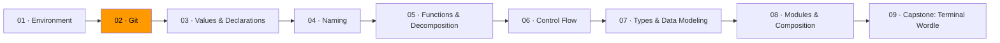

# 02 · Git



Git tracks every change you make to your code. Not just the current version — every version, forever. You can undo mistakes, work on multiple features at the same time, and collaborate with other people without overwriting each other's work.

This module covers Git fully. The rest of the curriculum assumes you know it. We won't revisit branching or merging later, so take this one seriously.

## How Git thinks

Git doesn't store files. It stores *snapshots*. Every time you commit, Git takes a picture of every file in your project at that moment. A commit is a snapshot plus a message describing what changed and why.

Commits form a chain. Each commit points back to its parent. The chain is your project's history — you can walk backwards through it to see exactly how things evolved.

```
commit 3 ← commit 2 ← commit 1
"fix bug"   "add login"  "initial"
```

**Branches** are just pointers to commits. When you create a branch, you're saying "I want to work on something without affecting the main line." When you merge, you bring the branch's changes back into main.

```
main:    1 ← 2 ← 3 ← 5 (merge)
                ↖       ↗
feature:         3 ← 4
```

**HEAD** is where you are right now. It points at the branch you're on, which points at the latest commit on that branch.

## The commands that matter

You don't need to memorize 50 git commands. These cover 95% of what you'll do:

| Command | What it does |
|---------|-------------|
| `git init` | Start tracking a directory |
| `git status` | See what's changed since the last commit |
| `git add <file>` | Stage a file for the next commit |
| `git commit -m "message"` | Save a snapshot with a description |
| `git log --oneline` | See the commit history |
| `git diff` | See what changed (unstaged) |
| `git branch <name>` | Create a new branch |
| `git switch <name>` | Move to a different branch |
| `git merge <branch>` | Bring a branch's changes into the current branch |
| `git push` | Send commits to GitHub |
| `git pull` | Get commits from GitHub |

## Commit messages

A commit message answers: *what changed and why?*

Bad: `"update stuff"`, `"fix"`, `"wip"`

Good: `"add input validation for email field"`, `"fix off-by-one in pagination count"`, `"remove unused auth middleware"`

The first line should be short (under 72 characters) and written as an imperative — "add" not "added," "fix" not "fixed." If you need more detail, leave a blank line and write a longer explanation below.

## Merge conflicts

A merge conflict happens when two branches change the same line. Git can't guess which version you want, so it asks you to decide.

Git marks the conflict in the file:

```
<<<<<<< HEAD
fmt.Println("version from main")
=======
fmt.Println("version from feature branch")
>>>>>>> feature
```

You pick the right version (or combine them), remove the markers, and commit. That's it. Conflicts sound scary but they're just a question: "which one did you mean?"

## Exercises

1. **[Commit archaeology](exercise-01-commit-archaeology/)** — explore a repo's history using `git log`, `git show`, and `git diff`
2. **[Branch and merge](exercise-02-branch-and-merge/)** — create branches, make changes, merge them, and resolve a conflict
3. **[Time travel](exercise-03-time-travel/)** — use `git bisect` to find a bug and `git revert` to undo it
4. **[Going remote](exercise-04-going-remote/)** — fork, branch, push, and open a pull request

## Resources

- [ThePrimeagen — Everything You'll Need to Know About Git](https://theprimeagen.github.io/fem-git/) — the best Git course, covers everything including bisect, revert, reset, and worktrees
- [MIT — The Missing Semester: Version Control](https://missing.csail.mit.edu/2020/version-control/) — Git explained through its data model
- [Git — Official documentation](https://git-scm.com/doc) — reference when you need the details
