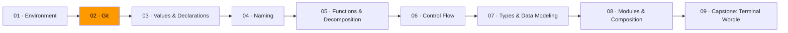

# 02 · Git



*In Module 01, you set up your tools. Now you'll learn the one that tracks everything you build.*

Most people learn Git as a list of commands. `add`, `commit`, `push`, repeat. Then something goes wrong — a merge conflict, a detached HEAD — and the commands stop making sense because there was never a model underneath them.

This module teaches the model. Once you understand what a commit actually *is*, the commands become obvious consequences. You stop memorizing and start reasoning.

## Snapshots, not diffs

Git does not store "what changed." It stores "what everything looks like right now." Every commit is a complete snapshot of your project at that moment.

Three objects make up the entire system:

| Object | What it is |
|--------|-----------|
| **blob** | A file's content. Raw bytes. |
| **tree** | A directory. Maps names to blobs or other trees. |
| **commit** | A snapshot (pointer to a tree) + parent commit(s) + author + message. |

Every object is identified by a SHA hash of its contents. Same content, same hash. History is a graph — commits point to their parents:

```
o ← o ← o ← o          main
              ↑
         o ← o           feature
```

## The three areas

Git has three places where your files live. Understanding these kills the confusion around `add`, `commit`, and `restore`.

```
┌─────────────────┐     git add     ┌─────────────────┐    git commit    ┌─────────────────┐
│  Working        │ ──────────────→ │  Staging Area   │ ──────────────→ │  Repository     │
│  Directory      │                 │  (Index)        │                 │  (.git/)        │
│                 │ ←────────────── │                 │                 │                 │
└─────────────────┘  git restore    └─────────────────┘                 └─────────────────┘
```

**Working directory** — the actual files on disk. What you see in your editor.

**Staging area** — a holding zone. `git add` copies a file's current state here. This lets you commit *part* of your changes — stage the bugfix, leave the debug prints out.

**Repository** — the `.git` directory. `git commit` takes everything staged, wraps it in a commit object, stores it permanently.

The staging area is the key insight most people miss. One logical change per commit, even if you touched five files for three reasons.

## Branches are pointers

A branch is not a copy of your code. It's a tiny file containing one commit hash.

When you commit on `main`, Git updates that file to point to the new commit. Creating a branch is instant because you're creating a pointer, not copying anything. **HEAD** tells Git where you are — it usually points to a branch name.

## Merging and conflicts

A merge combines two lines of history. Git finds the common ancestor and compares both branches against it.

- Only one side changed a file? Use that version.
- Both changed different lines? Auto-merge.
- Both changed the **same lines**? Conflict. You decide.

```
<<<<<<< HEAD
fmt.Println("hello from main")
=======
fmt.Println("hello from feature")
>>>>>>> feature
```

Conflicts are not errors. They're questions: "You changed the same thing two ways — which did you mean?"

## Commit messages

The diff shows *what* changed. The message explains *why*.

```
Add input validation for email field

The signup form accepted malformed addresses, causing
errors in the verification service. Adds a regex check
before submission.
```

**First line**: imperative mood, under 72 chars. "Add" not "Added." Think: "If applied, this commit will ___."

**Bad**: `"update stuff"`, `"fix"`, `"wip"`, `"changes"`

**Good**: `"fix off-by-one in pagination count"`, `"remove unused auth middleware"`

If your message needs the word "and," you probably need two commits.

## The commands that matter

| Command | What it does |
|---------|-------------|
| `git add <file>` | Stage a file |
| `git commit -m "msg"` | Create a commit from staged files |
| `git status` | Compare working dir vs staging vs last commit |
| `git log --oneline --graph` | View commit history |
| `git diff` | See unstaged changes |
| `git branch <name>` | Create a branch |
| `git switch <name>` | Switch to a branch |
| `git merge <branch>` | Merge a branch into current |
| `git push` / `git pull` | Sync with remote |

## Exercises

1. **[Commit archaeology](exercise-01-commit-archaeology/)** — explore a repo's history using `git log`, `git show`, and `git diff`
2. **[Branch and merge](exercise-02-branch-and-merge/)** — create branches, merge them, resolve a conflict
3. **[Time travel](exercise-03-time-travel/)** — use `git bisect` to find a bug and `git revert` to undo it
4. **[Going remote](exercise-04-going-remote/)** — fork, branch, push, and open a pull request

## Resources

- [ThePrimeagen — Everything You'll Need to Know About Git](https://theprimeagen.github.io/fem-git/) — the best Git course; teaches the model first
- [MIT — The Missing Semester: Version Control](https://missing.csail.mit.edu/2020/version-control/) — Git explained through its data model
- [Git — Official documentation](https://git-scm.com/doc) — reference for precise behavior

*Next: [Module 03 — Values & Declarations](../module-03-values-and-declarations/). You have your tools. You have version control. Now you write Go.*
