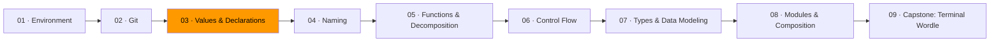

# 03 · Values & Declarations



*In Module 02, you learned to track the history of your code. Now you need to understand what code actually does — and it starts with data.*

Strip away the syntax, the frameworks, the tooling. A program takes data in, transforms it, and produces data out. Keyboard input, file contents, network request — doesn't matter where it comes from. Text on screen, database row, signal to another process — doesn't matter where it goes. The core activity is always: take values, transform them, produce new values.

Once you see programs as data pipelines instead of instruction sequences, you stop following tutorials and start solving problems.

## Values and types

A value is a piece of data. `42`. `"hello"`. `true`. Values don't change — `42` is always `42`.

Values have types. The type tells you what operations make sense. You can add two integers. You can concatenate two strings. You can't add an integer to a string — not because the computer can't mangle the bits, but because the operation has no meaning.

| Type | What it is | Example |
|------|-----------|---------|
| `int` | Whole numbers | `42`, `-7` |
| `float64` | Decimal numbers | `3.14` |
| `string` | Text | `"hello"` |
| `bool` | True or false | `true`, `false` |
| `byte` | A single byte (alias for `uint8`) | `'A'` |
| `rune` | A Unicode character (alias for `int32`) | `'界'` |

## Binding names to values

A declaration binds a name to a value:

```go
var name string = "Auburn"    // explicit type
count := 42                   // inferred type — Go figures it out
```

The short form (`:=`) is what you'll use 90% of the time inside functions. Use `var` when you need to declare without assigning, or when you want to be explicit about the type.

## Const by default

A **constant** cannot be rebound. A **variable** can.

```go
const maxAttempts = 6
// maxAttempts = 7   // compile error — good

score := 85
score = 92           // fine — score is a variable
```

When you read a constant, you know its value without tracing any code. It's the same at line 1 as at line 500. Variables create a burden — you have to track every reassignment to know the current value.

**Default to `const`.** Every value that doesn't need to change should be one. Go limits `const` to basic types (numbers, strings, booleans). For slices and structs, the discipline is on you.

Every type in Go starts at a defined **zero value** — `0` for ints, `""` for strings, `false` for bools, `nil` for pointers. You'll never read garbage from an uninitialized variable.

## Expressions compose, statements don't

An **expression** produces a value: `2 + 3`, `len("hello")`, `age >= 18`.

A **statement** performs an action: `x := 10`, `fmt.Println(x)`, `if x > 0 { ... }`.

Expressions nest. Statements don't.

```go
// Statement-heavy: three temporary variables
trimmed := strings.TrimSpace(input)
lowered := strings.ToLower(trimmed)
result := len(lowered)

// Expression-oriented: one pipeline
result := len(strings.ToLower(strings.TrimSpace(input)))
```

Neither is always better. Short pipeline? Expression form. Intermediate values need names for clarity? Statements. You'll develop the judgment.

## Data has shape

The idea that connects values to everything else: **choosing the right shape for your data is the most important decision in programming.**

```go
scores := []int{98, 85, 92, 77}                  // ordered collection, same type

capitals := map[string]string{                     // key-value pairs, fast lookup
    "Alabama": "Montgomery",
    "Georgia": "Atlanta",
}

type Student struct {                              // named fields, different types
    Name  string
    Major string
    GPA   float64
}
```

When you model a domain, the first question isn't "what should the code do?" It's "what does the data look like?" Get the shape right and the code writes itself. Get it wrong and you fight the representation at every step. Module 07 goes deep on this. For now, sketch the shapes before you write any logic.

## Exercises

1. **[Const by default](exercise-01-const-by-default/)** — convert variables to constants where possible and explain why each remaining variable must stay mutable
2. **[Expression vs. statement](exercise-02-expression-vs-statement/)** — rewrite statement-heavy code using expressions, simplify boolean logic buried under temps
3. **[Data shape sketcher](exercise-03-data-shape-sketcher/)** — model real-world domains as Go types before writing any logic

## Resources

- [Go — A Tour of Go](https://go.dev/tour/) — interactive tour covering variables, types, and control flow
- [Go — Effective Go](https://go.dev/doc/effective_go) — the official style guide
- [Go Proverbs](https://go-proverbs.github.io/) — the philosophical foundations of Go, one sentence each
