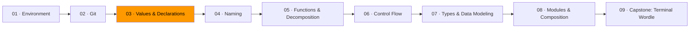

# 03 · Values & Declarations



Before you write logic, you need to understand what data is and how to hold onto it.

Every program is just data being created, transformed, and passed around. A variable holds a value. A constant holds a value that never changes. An expression produces a value. A statement does something. That's the entire vocabulary for this module.

## Variables and constants

In Go, you declare variables in two ways:

```go
var name string = "Auburn"    // explicit type
count := 42                   // short declaration, type inferred
```

The short form (`:=`) is what you'll use most of the time inside functions. Go figures out the type from the value on the right side.

**Constants** are values that are fixed at compile time. They can't change.

```go
const maxAttempts = 5
const appName = "wordle"
```

### Default to `const` when you can

If a value doesn't change, make it a constant. This isn't just style — it's a promise to the reader. When someone sees `const`, they know this value is stable. They don't have to trace through the code to find out if something modifies it later. When they see `var` or `:=`, they know to watch for changes.

Go's `const` is limited to basic types (numbers, strings, booleans), so you can't make a `const` slice or struct. For those, the convention is to define them at the top of the function or package scope and not mutate them.

### Zero values

In Go, every variable has a zero value — the default when you declare without assigning:

| Type | Zero value |
|------|-----------|
| `int` | `0` |
| `float64` | `0.0` |
| `string` | `""` (empty string) |
| `bool` | `false` |
| pointer, slice, map | `nil` |

This is a design choice. Go doesn't have uninitialized memory. Every variable starts in a known state.

## Expressions vs. statements

An **expression** produces a value. You can use it on the right side of `=`, pass it as an argument, or return it from a function.

```go
2 + 3              // expression: produces 5
len("hello")       // expression: produces 5
x > 0              // expression: produces true or false
```

A **statement** performs an action. It doesn't produce a value you can use somewhere else.

```go
x := 10            // statement: declares and assigns
fmt.Println(x)     // statement: prints (the return values are usually ignored)
if x > 0 { ... }   // statement: controls flow
```

The distinction matters because expressions compose — you can nest them, chain them, pass them around. Statements are steps. When you're deciding how to structure code, ask yourself: am I computing a value (use an expression) or performing an action (use a statement)?

## Data has shape

Every piece of data has a type that describes its shape. Go's basic types:

```go
var age int           // whole numbers
var price float64     // decimal numbers
var name string       // text
var active bool       // true or false
var initial byte      // a single byte (alias for uint8)
var letter rune       // a Unicode character (alias for int32)
```

Go also has compound types for grouping data:

```go
// A slice — ordered collection of same-type values
scores := []int{98, 85, 92, 77}

// A map — key-value pairs
capitals := map[string]string{
    "Alabama":  "Montgomery",
    "Georgia":  "Atlanta",
}

// A struct — a group of named fields
type Student struct {
    Name  string
    Major string
    GPA   float64
}
```

We'll go deeper on structs and custom types in Module 07. For now, recognize that choosing the right shape for your data is one of the most important decisions in programming. Get the shape right and the code that uses it writes itself. Get it wrong and you'll fight the shape every step of the way.

## Exercises

1. **[Const by default](exercise-01-const-by-default/)** — convert variables to constants where possible and explain why each remaining variable must stay mutable
2. **[Expression vs. statement](exercise-02-expression-vs-statement/)** — classify code snippets and rewrite statement-heavy code to use expressions
3. **[Data shape sketcher](exercise-03-data-shape-sketcher/)** — model real-world domains as Go types

## Resources

- [Go — A Tour of Go](https://go.dev/tour/) — interactive tour, covers variables, types, and control flow
- [Go — Effective Go](https://go.dev/doc/effective_go) — the official style guide, written by the Go team
