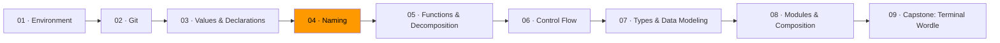

# 04 · Naming



Naming is the hardest part of programming. Not algorithms. Not architecture. Naming.

A good name means the reader understands the code without opening anything else. A bad name means they have to read the implementation, trace the callers, and hold context in their head that the name should have given them for free. Every time you force a reader to do that, you've taxed them. Do it enough and the codebase becomes unreadable.

If you struggle to name something, that's not a vocabulary problem. It's a design signal. The thing you're trying to name probably does too many things or doesn't have a clear purpose. Fix the design and the name becomes obvious.

## The distance rule

The further a name travels from where it's declared, the more descriptive it needs to be.

| Scope | What works | Example |
|-------|-----------|---------|
| Loop body (3 lines) | Single letter | `i`, `v`, `ch` |
| Inside one function | Short, contextual | `user`, `total`, `err` |
| Package-level, unexported | Descriptive | `activeUsers`, `retryCount` |
| Exported (public API) | Fully spelled out | `ParseMarkdownToHTML`, `CalculateMonthlyRevenue` |

A single-letter variable in a three-line loop is perfectly clear. That same single-letter variable used 40 lines later is a mystery. Match the name to the distance it travels.

Go's convention leans short. The standard library uses `r` for readers, `w` for writers, `b` for buffers, `s` for strings — in narrow scopes where the type provides the context. Don't fight this convention. Do respect it by keeping your scopes narrow.

## Names describe what, not how

A function name should describe the transformation — what it does to its input or what it returns — not the mechanism it uses.

```go
// Bad: describes mechanism
func loop(items []Item) float64 { ... }
func recursiveSearch(node *Node) *Node { ... }

// Good: describes transformation
func totalPrice(items []Item) float64 { ... }
func findByID(node *Node, id string) *Node { ... }
```

A variable name should describe the value it holds, not the container it lives in.

```go
// Bad: describes container
var list = []string{"Monday", "Tuesday", "Wednesday"}
var m = map[string]int{"apples": 3, "oranges": 5}

// Good: describes meaning
var weekdays = []string{"Monday", "Tuesday", "Wednesday"}
var fruitCounts = map[string]int{"apples": 3, "oranges": 5}
```

## Part of speech matters

There's a pattern that makes code read naturally:

- **Types** are nouns: `Student`, `Order`, `HttpResponse`
- **Functions** are verbs: `calculateTotal`, `sendEmail`, `parseConfig`
- **Booleans** are predicates: `isActive`, `hasPermission`, `canRetry`
- **Errors** describe the failure: `ErrNotFound`, `ErrInvalidInput`, `ErrTimeout`
- **Collections** are plural nouns: `users`, `scores`, `items`

When code follows these conventions, it reads like sentences:

```go
if isActive(user) {
    orders := fetchOrders(user.ID)
    total := calculateTotal(orders)
    sendReceipt(user.Email, total)
}
```

You can read this without knowing what any of these functions do internally. The names carry the meaning.

## Naming as a diagnostic

When a name is awkward, don't reach for a thesaurus. Step back and ask: is this thing doing too much?

```go
// This name is a warning sign
func validateAndSaveUser(u User) error { ... }

// The "And" reveals two responsibilities. Split them.
func validate(u User) error { ... }
func save(u User) error { ... }
```

The awkward name was the symptom. The muddled design was the disease.

## Exercises

1. **[Name audit](exercise-01-name-audit/)** — rename every variable in a program where everything is named `x`, `temp`, or `data`
2. **[The distance rule](exercise-02-distance-rule/)** — evaluate and fix names based on their scope distance
3. **[Part of speech as design](exercise-03-part-of-speech/)** — apply naming conventions to make code read like prose

## Resources

- [Go — Effective Go: Names](https://go.dev/doc/effective_go#names) — Go's official naming conventions
- [Andrew Gerrand — What's in a name?](https://go.dev/talks/2014/names.slide) — naming in Go, from a Go team member
