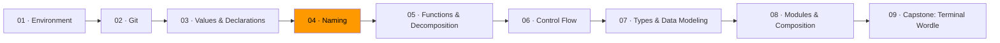

# 04 · Naming



*In Module 03, you learned what data is and how to bind names to it. Now you'll learn the skill that determines whether anyone — including future you — can read your code.*

Read this function. What does it do?

```go
func proc(d []string, x int) []string {
    var r []string
    for _, v := range d {
        if len(v) > x {
            t := strings.ToUpper(v[:1]) + v[1:]
            r = append(r, t)
        }
    }
    return r
}
```

Now read this one:

```go
func filterAndCapitalize(words []string, minLength int) []string {
    var result []string
    for _, word := range words {
        if len(word) > minLength {
            capitalized := strings.ToUpper(word[:1]) + word[1:]
            result = append(result, capitalized)
        }
    }
    return result
}
```

Same code. Same logic. But the second one you can read without reverse-engineering. That's the entire lesson. Naming is not a style preference — it's a correctness concern. A misleading name hides bugs.

## The distance rule

The further a name travels from where it's declared, the more descriptive it needs to be.

| Scope | What works | Example |
|-------|-----------|---------|
| Loop body (3 lines) | Single letter | `i`, `v`, `r` |
| Inside one function | Short, contextual | `count`, `err`, `buf` |
| Package-level, unexported | Descriptive | `activeUsers`, `retryLimit` |
| Exported (public API) | Fully qualified | `ParseMarkdownToHTML`, `ErrInvalidInput` |

Go leans shorter than most languages. The standard library uses `r` for `io.Reader`, `b` for `[]byte` buffers — in tight scopes where the type provides context. But this demands discipline: keep scopes narrow enough that short names stay unambiguous. If you need a long name inside a function, the function might be too long.

## Part-of-speech conventions

Code reads like prose when names follow consistent grammar.

**Types are nouns.** `Student`, `Connection`, `Order`.
**Functions are verbs.** `Parse`, `Close`, `Validate`.
**Booleans are predicates.** `isActive`, `hasPermission`, `canRetry` — not `status` or `flag`.
**Collections are plural.** `users`, `scores`, `items`.

When code follows these patterns, it reads like sentences:

```go
if isActive(user) {
    orders := fetchOrders(user.ID)
    total := calculateTotal(orders)
    sendReceipt(user.Email, total)
}
```

You can follow this without reading a single function body. The names carry the meaning.

## Naming difficulty is a design signal

If you can't name it, the design is muddled. The classic tell is "And" in a function name:

```go
func validateAndSaveUser(u User) error { ... }
```

"And" reveals two responsibilities. Split them:

```go
func validate(u User) error { ... }
func save(u User) error { ... }
```

The awkward name was the symptom. The muddled design was the disease. When the design is right, the name becomes obvious. You'll see this again in Module 05 when we talk about decomposition — naming difficulty tells you where to cut.

## Consistency

Use the same name for the same concept everywhere. If you use `block` here and `chunk` there and `segment` somewhere else, the reader has to verify whether the name difference signals a meaning difference. It usually doesn't. But they can't know without checking.

Avoid stutter between package names and exported symbols:

```go
// Bad                    // Good
bytes.ByteBuffer          bytes.Buffer
strings.StringReader      strings.Reader
widget.NewWidget          widget.New
```

## Exercises

1. **[Name audit](exercise-01-name-audit/)** — rename every variable in a program where everything is named `x`, `temp`, or `data`
2. **[The distance rule](exercise-02-distance-rule/)** — evaluate and fix names based on their scope distance
3. **[Part of speech as design](exercise-03-part-of-speech/)** — apply naming conventions to make code read like prose

## Resources

- [Go — Effective Go: Names](https://go.dev/doc/effective_go#names) — Go's official naming conventions
- [Andrew Gerrand — What's in a name?](https://go.dev/talks/2014/names.slide) — naming in Go, from a Go team member
- [Google Go Style Decisions — Naming](https://google.github.io/styleguide/go/decisions.html) — Google's internal Go naming conventions
- Ousterhout, John. *A Philosophy of Software Design*, 2nd ed. — Chapter 14: Choosing Names
- McConnell, Steve. *Code Complete*, 2nd ed. — Chapter 11: The Power of Variable Names
