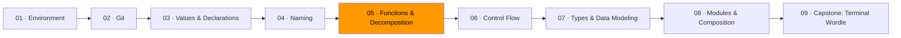

# 05 · Functions & Decomposition



*In Module 04, you learned that naming is design — and that `validateAndSaveUser` is a warning sign. Now you'll learn where to make the cut, and when to leave the knife in the drawer.*

A function is a named transformation. Data in, data out. The name describes what happens (Module 04). The body does it.

```go
func celsiusToFahrenheit(c float64) float64 {
    return c*9/5 + 32
}
```

No printing. No file reads. No mutation. Given the same input, always the same output. Not all functions have these properties. Learning which do and which don't is what this module is about.

## Pure vs. impure

A **side effect** is anything a function does besides returning a value.

```go
// Pure: returns a value, nothing else happens
func totalPrice(items []Item) int {
    total := 0
    for _, item := range items {
        total += item.Price * item.Quantity
    }
    return total
}

// Impure: writes to stdout — that's a side effect
func printReceipt(items []Item) {
    for _, item := range items {
        fmt.Printf("  %s: $%d.%02d\n", item.Name, item.Price/100, item.Price%100)
    }
}
```

You can't avoid side effects entirely — a program that never prints or writes is useless. But you can isolate them. Pure functions do the thinking. Impure functions do the doing. If you can return a value instead of printing it, do that. The caller can always print later.

## Four refactoring techniques

Each has a cost (more indirection) and a benefit (easier to read, test, change). Don't apply them everywhere. Recognize which fits the mess you're looking at.

### 1. Extract function

```go
// Before: parsing buried in a loop
for _, line := range lines {
    parts := strings.Split(line, ",")
    if len(parts) != 3 { continue }
    name := strings.TrimSpace(parts[0])
    score, err := strconv.Atoi(strings.TrimSpace(parts[1]))
    if err != nil { continue }
    grade := strings.TrimSpace(parts[2])
    records = append(records, Record{name, score, grade})
}

// After: the loop reads like a summary
for _, line := range lines {
    record, ok := parseLine(line)
    if !ok { continue }
    records = append(records, record)
}
```

**Helps when** the block does a coherent thing you can name clearly. **Hurts when** the block is 2-3 lines, or the extracted function needs 5+ parameters — you drew the boundary wrong.

### 2. Data table

```go
// Before: structurally identical cases
switch status {
case "todo":        return "○"
case "in-progress": return "◐"
case "done":        return "●"
default:            return "?"
}

// After: the mapping is visible at a glance
var statusEmojis = map[string]string{
    "todo": "○", "in-progress": "◐", "done": "●",
}
```

**Helps when** every case has the same shape. **Hurts when** cases differ — some compute, some validate, some call APIs. A map can't represent that honestly.

### 3. Separate traversal from decision

```go
// Before: selection and action tangled
func notifyOverdue(loans []Loan) {
    for _, loan := range loans {
        if loan.DueDate.Before(time.Now()) && !loan.Returned {
            sendReminder(loan.Borrower, loan.Book)
        }
    }
}

// After: overdueLoans is pure and testable
func overdueLoans(loans []Loan) []Loan {
    var overdue []Loan
    for _, loan := range loans {
        if loan.DueDate.Before(time.Now()) && !loan.Returned {
            overdue = append(overdue, loan)
        }
    }
    return overdue
}
```

**Helps when** the filter is complex or reused. **Hurts when** the filter is one trivial line.

### 4. Push I/O up

```go
// Before: decision and printing mixed
func reportWeather(tempC float64) {
    tempF := tempC*9/5 + 32
    if tempF > 100 {
        fmt.Println("Heat warning!")
    }
}

// After: pure function returns a value, caller prints
func weatherStatus(tempC float64) string {
    tempF := tempC*9/5 + 32
    if tempF > 100 {
        return "Heat warning!"
    }
    return fmt.Sprintf("%.0f°F — normal", tempF)
}
```

**Helps when** you want to test logic without capturing stdout. **Hurts when** both computation and I/O are one line each.

## When NOT to refactor

Every technique above adds indirection. The cost is real.

- **The code is short and clear.** A 10-line function with one if/else doesn't need to be three functions.
- **You'd create a shallow wrapper.** If the new function just calls another with the same arguments, it adds a layer with zero value.
- **It's a one-shot script.** Refactoring is an investment in the future. No future, no payoff.
- **You can't name it.** If the name doesn't come easily, the boundary isn't real. That's Module 04's lesson at work.

The goal is not "small functions." The goal is code where each unit is understandable on its own.

## Exercises

1. **[Extract till you drop](exercise-01-extract-till-you-drop/)** — break a 100-line function into named pieces using the techniques above
2. **[Pure vs. impure](exercise-02-pure-vs-impure/)** — identify side effects and refactor impure functions into pure cores with thin wrappers
3. **[File organization](exercise-03-file-organization/)** — reorganize a single file so it reads top to bottom

## Resources

- [Go — Effective Go: Functions](https://go.dev/doc/effective_go#functions) — Go's conventions for functions and multiple return values
- [Casey Muratori — Semantic Compression](https://caseymuratori.com/blog_0015) — code compression that isn't just "make functions smaller"
- Ousterhout, John. *A Philosophy of Software Design*, Ch. 4-5 — deep modules and information hiding at function scale
