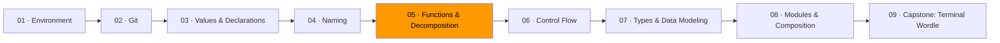
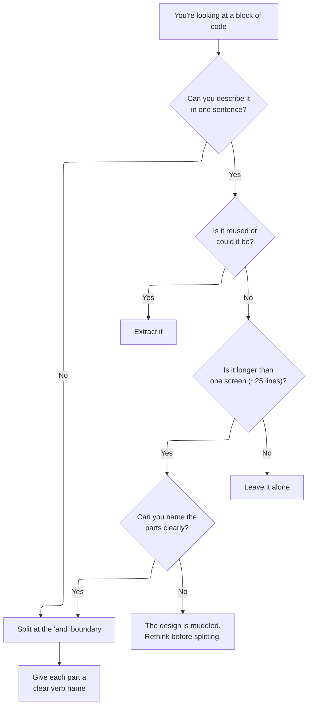

# 05 · Functions & Decomposition



A function does one thing. You should be able to describe what it does in a single sentence without using the word "and." If you can't, it does too much.

This module is about learning to see the seams in a problem — the natural places where you can split a big tangled thing into smaller clear things. It's also about understanding what a side effect is and why minimizing them makes your code dramatically easier to reason about.

## Decomposition: how to break problems apart

When you look at a big block of code, ask: "what are the distinct *steps* here?" Each step is a candidate for its own function. But don't split mechanically — split at the boundaries where one concern ends and another begins.

The goal isn't small functions for the sake of small functions. The goal is functions you can understand without context. If splitting a function means you have to read both halves to understand either one, the split made things worse.

### When to extract a function

There are no absolute rules here. But these heuristics are generally safe to follow:



The key insight: **naming difficulty is a design signal.** If you can't name the extracted function clearly, you probably haven't found a real boundary. Don't force the split.

### What to extract vs. what to leave

Extract when the extracted function:
- Has a clear name that describes a transformation
- Can be understood without reading the caller
- Hides real complexity behind a simple interface

Leave it inline when:
- The "function" would just be 2-3 lines that are already clear
- Understanding the extracted function requires reading the caller anyway
- The extraction forces you to pass 5+ parameters (this signals the wrong boundary)

## Side effects

A **side effect** is anything a function does besides computing a return value. Printing to the screen, writing to a file, modifying a global variable, making a network request — these are all side effects.

```go
// Pure — no side effects. Same input always gives same output.
func totalPrice(items []Item) float64 {
    total := 0.0
    for _, item := range items {
        total += item.Price * float64(item.Quantity)
    }
    return total
}

// Impure — side effect: prints to the screen.
func printReceipt(items []Item) {
    for _, item := range items {
        fmt.Printf("%s: $%.2f\n", item.Name, item.Price)
    }
    fmt.Printf("Total: $%.2f\n", totalPrice(items))
}
```

Pure functions are easier to test (pass in data, check the return), easier to reuse (no hidden dependencies), and easier to reason about (no surprises). The ideal is to keep your logic pure and push side effects to the edges — the "main" function, the HTTP handler, the CLI entrypoint.

You can't eliminate side effects entirely. A program that does nothing observable is useless. But you can *isolate* them. Keep the interesting logic pure; let the boring I/O wrapper be the one with side effects.

## File organization

Code in a file should be organized so a reader can follow it top to bottom.

A pattern that works well:

1. **Constants and types** at the top — the data shapes
2. **The main composition** — the function that ties everything together
3. **Supporting functions** in the order they're called by the composition
4. **Utility functions** at the bottom — small helpers used by multiple functions

```go
// 1. Types
type Order struct { ... }
type Receipt struct { ... }

// 2. Main composition
func processOrder(order Order) Receipt {
    validated := validateItems(order.Items)
    priced := applyPricing(validated)
    return generateReceipt(order.Customer, priced)
}

// 3. Supporting functions (in call order)
func validateItems(items []Item) []Item { ... }
func applyPricing(items []Item) []PricedItem { ... }
func generateReceipt(customer Customer, items []PricedItem) Receipt { ... }

// 4. Utilities
func formatCurrency(cents int) string { ... }
```

A reader starts at the top, sees the big picture, and can drill down into any step. They never have to scroll up to understand what comes below.

## When things get complex: refactoring strategies

Sometimes a function grows complex not because it does too many things, but because the *decision logic* is inherently complex. When that happens, extracting more functions doesn't help — you're just spreading the complexity around. Instead, consider these strategies:

**Replace branching with a data table.** If you have a long chain of if/else that maps inputs to outputs, a table is often clearer:

```go
// Before: branching
func shippingCost(region string) float64 {
    if region == "domestic" {
        return 5.99
    } else if region == "canada" {
        return 12.99
    } else if region == "europe" {
        return 24.99
    } else if region == "asia" {
        return 29.99
    }
    return 39.99
}

// After: data table
var shippingRates = map[string]float64{
    "domestic": 5.99,
    "canada":   12.99,
    "europe":   24.99,
    "asia":     29.99,
}

func shippingCost(region string) float64 {
    if rate, ok := shippingRates[region]; ok {
        return rate
    }
    return 39.99
}
```

The data table makes the mapping visible at a glance. Adding a new region is one line, not a new branch.

**Separate traversal from decision logic.** If you're iterating a collection and making decisions on each item, split the "what to look at" from "what to decide":

```go
// Before: traversal and decision interleaved
func processOrders(orders []Order) {
    for _, o := range orders {
        if o.Status == "pending" && o.Total > 100 {
            applyDiscount(o)
            sendNotification(o)
        }
    }
}

// After: separated
func pendingHighValue(orders []Order) []Order { ... }

func processOrders(orders []Order) {
    for _, o := range pendingHighValue(orders) {
        applyDiscount(o)
        sendNotification(o)
    }
}
```

## Exercises

1. **[Extract till you drop](exercise-01-extract-till-you-drop/)** — break a 100-line function into small, named pieces
2. **[Pure vs. impure](exercise-02-pure-vs-impure/)** — identify side effects and refactor impure functions into pure cores
3. **[File organization](exercise-03-file-organization/)** — reorganize a single file into a readable top-to-bottom flow

## Resources

- [Go — Effective Go: Functions](https://go.dev/doc/effective_go#functions) — Go's conventions for functions, including multiple return values
- [MIT — The Missing Semester: Debugging and Profiling](https://missing.csail.mit.edu/2020/debugging-profiling/) — when functions need to be profiled, not just named well
