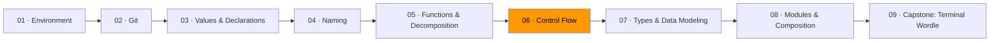

# 06 · Control Flow



The shape of your control flow determines whether code is readable or not. Deeply nested code — where you're four `if` statements deep before you reach the actual logic — is the number one readability killer in real codebases. It's not wrong. It's just hard to hold in your head.

This module teaches you to write code that flows top to bottom, with decisions handled early and the main logic at the top indentation level.

## Guard clauses: reject early, then do the work

A guard clause checks for a condition that would prevent the function from doing its job, and returns immediately if that condition is true. After all the guards, the remaining code handles the normal case at the shallowest indentation level.

```go
// Before: nested conditionals
func processOrder(order Order) (Receipt, error) {
    if order.Items != nil {
        if len(order.Items) > 0 {
            if order.Customer.IsActive {
                if order.Total() > 0 {
                    // ... actual logic buried 4 levels deep
                } else {
                    return Receipt{}, errors.New("empty order")
                }
            } else {
                return Receipt{}, errors.New("inactive customer")
            }
        } else {
            return Receipt{}, errors.New("no items")
        }
    } else {
        return Receipt{}, errors.New("nil items")
    }
}

// After: guard clauses
func processOrder(order Order) (Receipt, error) {
    if order.Items == nil {
        return Receipt{}, errors.New("nil items")
    }
    if len(order.Items) == 0 {
        return Receipt{}, errors.New("no items")
    }
    if !order.Customer.IsActive {
        return Receipt{}, errors.New("inactive customer")
    }
    if order.Total() <= 0 {
        return Receipt{}, errors.New("empty order")
    }

    // Actual logic — flat, clear, one level of indentation.
    receipt := buildReceipt(order)
    return receipt, nil
}
```

The nested version forces you to read all the way to the bottom to find the error cases, then back up to find the happy path. The guard version reads top to bottom: deal with problems, then do the work.

## Named conditions: boolean variables as documentation

When a conditional has multiple parts, assign it to a well-named boolean variable. The name documents the *meaning* of the condition. The code reads like English.

```go
// Before: the reader has to figure out what this means
if user.Age >= 18 && user.EmailVerified && !user.Suspended && user.SubscriptionEnd.After(time.Now()) {
    grantAccess(user)
}

// After: named condition explains the intent
canAccess := user.Age >= 18 &&
    user.EmailVerified &&
    !user.Suspended &&
    user.SubscriptionEnd.After(time.Now())

if canAccess {
    grantAccess(user)
}
```

This isn't just style. When the condition is wrong, the named version tells you *what the programmer intended*. You can compare the intent (the name) against the implementation (the boolean expression) and spot the mismatch. The unnamed version doesn't give you that.

You can also break complex conditions into parts:

```go
isOfAge := user.Age >= 18
isVerified := user.EmailVerified && !user.Suspended
hasActiveSubscription := user.SubscriptionEnd.After(time.Now())

canAccess := isOfAge && isVerified && hasActiveSubscription
```

Each piece has a name. Each name is testable. The whole thing reads like a checklist.

## Replace branching with data

When you have a long if/else or switch that maps inputs to outputs with no logic between them, a data table is almost always clearer. This is the same pattern from Module 05, applied specifically to control flow.

```go
// Before: branching
func httpStatusText(code int) string {
    switch code {
    case 200:
        return "OK"
    case 201:
        return "Created"
    case 400:
        return "Bad Request"
    case 401:
        return "Unauthorized"
    case 403:
        return "Forbidden"
    case 404:
        return "Not Found"
    case 500:
        return "Internal Server Error"
    default:
        return "Unknown"
    }
}

// After: data table
var httpStatusTexts = map[int]string{
    200: "OK",
    201: "Created",
    400: "Bad Request",
    401: "Unauthorized",
    403: "Forbidden",
    404: "Not Found",
    500: "Internal Server Error",
}

func httpStatusText(code int) string {
    if text, ok := httpStatusTexts[code]; ok {
        return text
    }
    return "Unknown"
}
```

The data version separates the "what" (the mapping) from the "how" (the lookup). Adding a new status code is one line in the map. You can also iterate the map, test it, or generate it from a file.

## The complexity budget

Every function has a complexity budget. Each nesting level, each branch, each early return costs something. You don't get unlimited levels for free. Steve McConnell recommends keeping the maximum nesting depth to three or four levels as a practical limit.

When you hit that limit, it's a signal to restructure:

1. **Can I use guard clauses?** Handle error cases first, then the happy path is flat.
2. **Can I name a condition?** Extract a boolean variable that explains the intent.
3. **Can I use a data table?** Replace a long switch/if-else chain with a map.
4. **Can I extract a function?** But only if the extracted piece makes sense on its own.
5. **Is the function doing too much?** Sometimes the right answer is to split the problem, not the code.

This isn't a checklist you follow mechanically. It's a set of tools you reach for when the code feels harder to read than it should be.

## Switch exhaustiveness

Go's `switch` statement doesn't have implicit fallthrough (unlike C). Each case is isolated. But Go also doesn't enforce exhaustive matching on non-enum types. You should always include a `default` case to handle unexpected values explicitly.

```go
func describeDay(day string) string {
    switch day {
    case "Monday", "Tuesday", "Wednesday", "Thursday", "Friday":
        return "weekday"
    case "Saturday", "Sunday":
        return "weekend"
    default:
        return "unknown day: " + day
    }
}
```

In Module 07, you'll learn about `iota` enums and how to make the type system enforce that every case is handled. For now, always write the `default`.

## Exercises

1. **[Flatten the pyramid](exercise-01-flatten-the-pyramid/)** — refactor deeply nested code using guard clauses
2. **[Named conditions](exercise-02-named-conditions/)** — extract complex boolean expressions into named variables
3. **[Linear flow](exercise-03-linear-flow/)** — rewrite a function with tangled control flow into a clean top-to-bottom structure

## Resources

- [Go — Effective Go: Control structures](https://go.dev/doc/effective_go#control-structures) — Go's conventions for if, for, and switch
- [Roadmap.sh — Go: Conditionals](https://roadmap.sh/golang) — Go-specific control flow patterns
