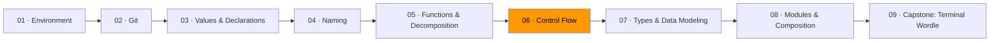

# 06 · Control Flow



*In Module 05, you learned to decompose problems into functions. Now you'll learn what happens inside those functions — how to shape control flow so the reader follows a straight line, not a maze.*

What does this function do?

```go
func processOrder(order Order) (Receipt, error) {
    if order.Items != nil {
        if len(order.Items) > 0 {
            if order.Customer.IsActive {
                if order.Total() > 0 {
                    return buildReceipt(order), nil
                } else {
                    return Receipt{}, errors.New("empty total")
                }
            } else {
                return Receipt{}, errors.New("inactive customer")
            }
        } else {
            return Receipt{}, errors.New("no items")
        }
    } else {
        return Receipt{}, errors.New("nil items")
    }
}
```

Four levels deep. You have to hold the entire nesting stack in your head to match each error to its condition. Now read this:

```go
func processOrder(order Order) (Receipt, error) {
    if order.Items == nil {
        return Receipt{}, errors.New("nil items")
    }
    if len(order.Items) == 0 {
        return Receipt{}, errors.New("no items")
    }
    if !order.Customer.IsActive {
        return Receipt{}, errors.New("inactive customer")
    }
    if order.Total() <= 0 {
        return Receipt{}, errors.New("empty total")
    }

    return buildReceipt(order), nil
}
```

Same logic. Same number of paths. But each check is self-contained: condition, consequence, done. The happy path flows straight down the page.

## Guard clauses

A guard clause checks for a condition that prevents the function from doing its work, then returns immediately. After the guards, the remaining code runs at the shallowest indentation.

Go's own convention: "When an `if` body ends in `break`, `continue`, `goto`, or `return`, omit the `else`." No else after return. The successful flow continues unindented.

**Helps when** a function has multiple preconditions — input validation, nil checks. **Hurts when** the "error" and "success" paths are symmetric and equally complex.

## Named conditions

When a conditional has multiple clauses, extract it into a named boolean. The name documents intent — Module 04's naming lesson applied directly.

```go
// Before: reader parses boolean logic inline
if user.Age >= 18 && user.EmailVerified && !user.Suspended &&
    user.SubscriptionEnd.After(time.Now()) {
    grantAccess(user)
}

// After: the name tells you what the check means
canAccess := user.Age >= 18 &&
    user.EmailVerified &&
    !user.Suspended &&
    user.SubscriptionEnd.After(time.Now())

if canAccess {
    grantAccess(user)
}
```

One extra line saves every future reader from parsing four sub-expressions. When the condition is wrong, the name tells you what was *intended*.

**Helps when** the expression has more than two clauses. **Hurts when** the condition is trivial — `isPositive := x > 0` before `if isPositive` adds noise.

## Data tables replacing branches

When a switch maps inputs to outputs and every case has the same shape, a map is clearer. You saw this in Module 05's data table technique.

```go
var httpStatusTexts = map[int]string{
    200: "OK", 201: "Created",
    400: "Bad Request", 404: "Not Found",
    500: "Internal Server Error",
}

func httpStatusText(code int) string {
    if text, ok := httpStatusTexts[code]; ok {
        return text
    }
    return "Unknown"
}
```

Data separated from mechanism. Adding a status is one line. **Does not work when** the branches have different shapes — if case A computes, case B calls an API, and case C validates, a map can't represent that.

## Switch

Go's `switch` doesn't fall through by default. But it also doesn't enforce that you handle every value. Always include a `default` case:

```go
func describeDay(day string) string {
    switch day {
    case "Monday", "Tuesday", "Wednesday", "Thursday", "Friday":
        return "weekday"
    case "Saturday", "Sunday":
        return "weekend"
    default:
        return "unknown day: " + day
    }
}
```

In Module 07, you'll learn about `iota` enums that constrain the value space. Combined with linters, you can get guarantees that every case is handled.

## The tension

There's a real tension here, and it doesn't have a clean resolution. When you split a function into three helpers that are only called from one place, you haven't reduced complexity — you've spread it across more locations. A function you have to cross-reference is sometimes worse than 30 lines you can read in place.

Guard clauses can create long preambles that push the interesting code off-screen. Named conditions can over-abstract simple checks. Data tables hide different-shaped logic behind a uniform facade.

No formula resolves this. If the extracted piece has a clear name, a clear contract, and could be tested independently, extract it. If it's just "the middle part of the other function," leave it inline.

## Exercises

1. **[Flatten the pyramid](exercise-01-flatten-the-pyramid/)** — refactor deeply nested code using guard clauses
2. **[Named conditions](exercise-02-named-conditions/)** — extract complex boolean expressions into named variables
3. **[Linear flow](exercise-03-linear-flow/)** — rewrite tangled control flow into a clean top-to-bottom structure

## Resources

- [Effective Go — Control structures](https://go.dev/doc/effective_go#control-structures) — Go's conventions for `if`, `for`, and `switch`
- [Google Go Style Decisions](https://google.github.io/styleguide/go/decisions.html) — Google's conventions for Go code structure
- McConnell, Steve. *Code Complete*, 2nd ed. — Chapter 19: General Control Issues
- Ousterhout, John. *A Philosophy of Software Design* — deep vs. shallow modules, complexity as the central problem
- Muratori, Casey. ["Clean Code, Horrible Performance"](https://www.computerenhance.com/p/clean-code-horrible-performance) — the cost of scattering logic across abstractions

*Next: [Module 07 · Types & Data Modeling](../module-07-types-and-data-modeling/) — constrain the value space so invalid states can't exist.*
