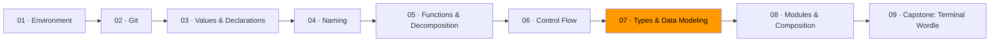

# 07 · Types & Data Modeling



*In Module 06, you learned to write code that flows in a straight line. Now you'll learn the tool that makes most of those control flow decisions unnecessary — the type system.*

This is the most important module in the track. Everything else — naming, decomposition, control flow — teaches you to write code that humans can read. Types teach you to write code where entire categories of bugs cannot exist. That is a different thing.

---

## 1 · Why types matter

Most programmers treat types as annotations they add for the compiler. Labels on boxes. That is backwards. A type is a design decision. Every constraint you encode in a type is a runtime check you will never write, a test you will never need, a bug report you will never receive.

This principle is called **defining errors out of existence**. Consider a text editor with a selection mechanism. The naive design checks everywhere whether a selection exists. The better design makes a zero-length selection the default state. Now "no selection" and "empty selection" are the same thing. The `if` statements vanish — not because you were clever about control flow, but because you chose a representation that made the error condition impossible.

This is the core insight: **the best way to deal with errors is to make them impossible.** Not to handle them gracefully. Not to log them. To make the program unable to represent the bad state at all.

Go's type system is not as expressive as Haskell's or Rust's. It does not have algebraic data types or dependent types. But it gives you enough to eliminate most of the bugs that actually ship in production software — if you use it deliberately.

---

## 2 · Making illegal states unrepresentable

This is the capstone concept. One type per valid state. If a state cannot exist, the type system prevents constructing it.

Consider a shipping order. An order moves through four states:

1. **Draft** — just created, no address yet
2. **Confirmed** — has a shipping address, no tracking number
3. **Shipped** — has a tracking number and ship date
4. **Delivered** — has a delivery date

### The bad version

```go
// Every field is always present. Most are meaningless.
type Order struct {
    ID          string
    Status      string    // "draft", "confirmed", "shipped", "delivered"
    Address     string    // empty in draft
    TrackingNum string    // empty until shipped
    ShippedAt   time.Time // zero until shipped
    DeliveredAt time.Time // zero until delivered
}
```

This type allows a "draft" order with a tracking number. A "delivered" order with no ship date. A status of `"banana"`. Every function that touches this struct must check for impossible combinations. You are now writing validators, defensive `if` statements, and tests for states that should not exist. The type did not help you. It created work.

This design **complects** identity and state. Six fields braided together that never all make sense at the same time. The result is a value that lies about what it knows.

### The good version

```go
type DraftOrder struct {
    ID string
}

type ConfirmedOrder struct {
    ID      string
    Address string
}

type ShippedOrder struct {
    ID          string
    Address     string
    TrackingNum string
    ShippedAt   time.Time
}

type DeliveredOrder struct {
    ID          string
    Address     string
    TrackingNum string
    ShippedAt   time.Time
    DeliveredAt time.Time
}
```

Now a `DraftOrder` cannot have a tracking number — the field does not exist. A `DeliveredOrder` always has a ship date — the compiler requires it at construction. Each type carries exactly the data that is meaningful for its state. No more, no less.

The state transitions become function signatures:

```go
func Confirm(d DraftOrder, address string) ConfirmedOrder { ... }
func Ship(c ConfirmedOrder, tracking string) ShippedOrder { ... }
func Deliver(s ShippedOrder) DeliveredOrder { ... }
```

You cannot ship a draft. You cannot deliver a confirmation. The compiler enforces the business rules. The `if` statements from the bad version are gone — not refactored, not hidden behind a helper. Gone. The type system made them unnecessary.

Types should serve the data, not the other way around. This is what that looks like. The data says an order in draft state has an ID and nothing else. The type says exactly that. No extra fields "just in case." No optional pointers. The representation matches reality.

### When to prefer domain types over primitives

A common temptation: use `string` for email addresses, `int` for user IDs, `float64` for money. These are **primitive obsession** — using a generic type where a domain type would prevent misuse.

```go
// Dangerous: nothing stops you from passing a username where an email is expected
func SendConfirmation(email string, username string) error

// Better: the type system catches the mixup at compile time
type EmailAddress string
type Username string
func SendConfirmation(email EmailAddress, username Username) error
```

This costs nothing at runtime. It costs nothing in readability. What it buys you is that `SendConfirmation(username, email)` — arguments swapped — is a compile error instead of a production bug.

---

## 3 · Enums with `iota`

Go has no `enum` keyword. It has something more flexible: `iota`, a constant generator that produces a closed set of values from a named type.

```go
type Direction int

const (
    North Direction = iota // 0
    East                   // 1
    South                  // 2
    West                   // 3
)
```

`iota` starts at 0 and increments by 1 for each constant in the block. The type `Direction` constrains the set. Using a raw `int` or `string` would allow any value — "northwest," -7, the empty string. The named type narrows the domain.

### Making enums printable

```go
func (d Direction) String() string {
    return [...]string{"North", "East", "South", "West"}[d]
}
```

This implements the `fmt.Stringer` interface. Now `fmt.Println(North)` prints `"North"` instead of `"0"`. The array literal approach is compact and fails fast — an out-of-range value causes a panic at the index operation, which is exactly what you want for an invalid enum.

### Sealed interfaces: Go's answer to sum types

For enums where each variant carries different data, Go uses interfaces with an unexported method:

```go
type Shape interface {
    Area() float64
    perimeter() float64
    isShape()  // unexported — only this package can implement Shape
}

type Circle struct{ Radius float64 }
type Rectangle struct{ Width, Height float64 }

func (c Circle) Area() float64      { return math.Pi * c.Radius * c.Radius }
func (c Circle) perimeter() float64  { return 2 * math.Pi * c.Radius }
func (c Circle) isShape()           {}

func (r Rectangle) Area() float64      { return r.Width * r.Height }
func (r Rectangle) perimeter() float64  { return 2 * (r.Width + r.Height) }
func (r Rectangle) isShape()           {}
```

The unexported `isShape()` method is the trick. Only types defined in this package can implement it. External packages cannot add new variants. This is a sealed set — Go's equivalent of a sum type or discriminated union. You now have a closed set of shapes, and a type switch covers all cases:

```go
func Describe(s Shape) string {
    switch v := s.(type) {
    case Circle:
        return fmt.Sprintf("circle with radius %.1f", v.Radius)
    case Rectangle:
        return fmt.Sprintf("%0.1f × %.1f rectangle", v.Width, v.Height)
    }
    // unreachable if the set is sealed — but Go does not enforce exhaustiveness
    panic("unknown shape")
}
```

The bigger the interface, the weaker the abstraction. A one-method interface like `io.Reader` is powerful because nearly anything can implement it. A ten-method interface is a concrete type in disguise. Keep interfaces small. One or two methods. Let the consumer define the interface, not the producer.

`interface{}` says nothing. An empty interface accepts any value and tells you nothing about what you can do with it. Every empty interface in your code is a place where the type system has been turned off. Use it when you must (e.g., `json.Unmarshal`). Avoid it as a design choice.

---

## 4 · Errors as values

Go treats errors as ordinary values, not exceptions. This is not a limitation. It is a design decision with deep consequences.

The Go blog post [*"Errors are values"*](https://go.dev/blog/errors-are-values) states the core idea:

> *"Values can be programmed, and since errors are values, errors can be programmed."*

The `error` interface is one method:

```go
type error interface {
    Error() string
}
```

A function that can fail returns an `error` alongside its result:

```go
func divide(a, b float64) (float64, error) {
    if b == 0 {
        return 0, errors.New("division by zero")
    }
    return a / b, nil
}
```

The caller must handle it. The two-value return makes ignoring the error a conscious act — you have to write `_` to discard it, and that `_` is visible in code review.

### Why not exceptions?

Exceptions create hidden control flow. A function can fail in ways that are invisible in its signature. You learn about failure modes by reading documentation, grepping for `throw`, or discovering them in production. Go's approach makes failure explicit: if a function can fail, you see `error` in the return type. No surprises.

This is the information hiding principle applied correctly. You hide *implementation details*. You do not hide *failure modes*. Failure is part of the interface.

### Three kinds of "not the happy path"

| Situation | Meaning | Go idiom |
|-----------|---------|----------|
| **Absence** | A value legitimately does not exist | Zero value + `bool`, or a pointer |
| **Failure** | An operation went wrong | Return `error` |
| **Invalidity** | Input violates a domain rule | Reject at construction (typed error) |

Do not conflate these. A user not found in the database is **absence**. The database being unreachable is **failure**. A negative user ID is **invalidity**. Each demands a different response. Treating them all as `error` loses information.

### Custom error types that carry context

From [Effective Go](https://go.dev/doc/effective_go#errors), the standard library's own pattern:

```go
type PathError struct {
    Op   string // "open", "unlink", etc.
    Path string // the file path
    Err  error  // the underlying system error
}

func (e *PathError) Error() string {
    return e.Op + " " + e.Path + ": " + e.Err.Error()
}
```

Callers can inspect the error programmatically:

```go
if e, ok := err.(*PathError); ok && e.Err == syscall.ENOSPC {
    deleteTempFiles()
    retry()
}
```

The error is not a string you parse. It is a struct with fields you inspect. This is what "errors are values" means in practice — you program with them.

### The `errWriter` pattern — programming with errors

The canonical example of treating errors as programmable values. Instead of checking after every write:

```go
_, err = fd.Write(p0[a:b])
if err != nil { return err }
_, err = fd.Write(p1[c:d])
if err != nil { return err }
_, err = fd.Write(p2[e:f])
if err != nil { return err }
```

Define a type that absorbs the error and becomes a no-op after the first failure:

```go
type errWriter struct {
    w   io.Writer
    err error
}

func (ew *errWriter) write(buf []byte) {
    if ew.err != nil {
        return
    }
    _, ew.err = ew.w.Write(buf)
}
```

Now:

```go
ew := &errWriter{w: fd}
ew.write(p0[a:b])
ew.write(p1[c:d])
ew.write(p2[e:f])
if ew.err != nil {
    return ew.err
}
```

One check. At the end. No lost errors. This pattern already exists in the standard library — `bufio.Writer` does exactly this, with `Flush()` surfacing the accumulated error.

Don't just check errors — handle them gracefully. Use the language to simplify your error handling. The `if err != nil` pattern is not a ritual. It is the starting point. After you understand it, you use Go's type system to write something better.

---

## 5 · FP vs OOP — when to use each

This is not a religious debate. It is a judgment call. Different problems have different shapes.

### Use values and pure functions when:

- You are computing a result from inputs — transforming data, not managing things
- The data does not change over time — you are mapping, filtering, reducing
- You want trivial testability — pure functions with no state are the easiest code to test

```go
func applyTax(price, rate float64) float64 {
    return price * (1 + rate)
}

func applyDiscount(price, percent float64) float64 {
    return price * (1 - percent/100)
}

// Compose: pipe data through transformations
finalPrice := applyDiscount(applyTax(basePrice, 0.08), 15)
```

No state. No mutation. No surprise. The function does one thing. You can call it a thousand times with the same inputs and get the same output. Values are independent of time. They do not complect.

### Use types with methods when:

- The data has **identity** — it represents a thing that exists over time (a user, a connection, a game)
- Construction invariants matter — a valid instance requires coordinated initialization
- Behavior and state are inseparable — the methods need the fields, the fields need the methods

```go
type Game struct {
    board [3][3]rune
    turn  rune
    moves int
}

func NewGame() *Game {
    return &Game{turn: 'X'}
}

func (g *Game) PlaceMarker(row, col int) error {
    if g.board[row][col] != 0 {
        return errors.New("cell already occupied")
    }
    g.board[row][col] = g.turn
    g.moves++
    if g.turn == 'X' {
        g.turn = 'O'
    } else {
        g.turn = 'X'
    }
    return nil
}
```

This is an entity. It has identity (this specific game, not some abstract game). It changes over time. It enforces invariants (alternating turns, no overwriting). A pure function would be wrong here — the game *is* the mutation.

### The judgment call

The line is clear: choose your representation by what the domain actually is.

- Is this a **value** you are computing? Use functions that take data and return data.
- Is this a **thing** you are managing? Use a type with methods that guard its invariants.
- Is this **data flowing through a pipeline**? Functions. Each step transforms, none mutates.
- Is this an **entity with a lifecycle**? Methods. The state changes are the point.

Most real programs use both. Pure functions for data transformations. Types with methods for entities with lifecycle. The mistake is reaching for one paradigm reflexively. Ask the question. Then choose.

---

## 6 · Composition over inheritance

Go does not have inheritance. This is not a limitation. It is a position.

### Embedding is composition, not inheritance

```go
type Logger struct {
    prefix string
}

func (l Logger) Log(msg string) {
    fmt.Printf("[%s] %s\n", l.prefix, msg)
}

type Server struct {
    Logger  // embedded — Server gets Log() for free
    addr string
}
```

`Server` has a `Log` method because it contains a `Logger`. It does not *extend* `Logger`. It is not a subtype. It is a struct that has a field, and Go promotes that field's methods. The mental model is "has-a," not "is-a."

This matters because inheritance creates coupling. When `Server` inherits from `Logger`, changing `Logger`'s interface changes `Server`'s interface. With embedding, `Server` owns the relationship. It can shadow `Log` with its own implementation. It can choose which embedded types to expose. The dependency goes one direction.

### Interfaces are behavioral contracts

```go
type Reader interface {
    Read(p []byte) (n int, err error)
}
```

`io.Reader` has one method. It is implemented by files, network connections, byte buffers, HTTP response bodies, compressed streams, and cipher blocks. That is the power of a small interface — it describes behavior, not identity.

The bigger the interface, the weaker the abstraction.

A large interface locks you into a concrete implementation. A small interface lets any type participate. The `io.Reader`/`io.Writer` pair is arguably the most successful abstraction in Go — precisely because each demands only one method.

### Accept interfaces, return structs

A common Go pattern: functions accept interface parameters and return concrete types.

```go
// Good: accepts any Reader, returns a concrete result
func CountLines(r io.Reader) (int, error) {
    scanner := bufio.NewScanner(r)
    count := 0
    for scanner.Scan() {
        count++
    }
    return count, scanner.Err()
}
```

The caller decides what to pass — a file, a string reader, a network connection. The function does not care. It asks only for `Read`. This is the deep module principle applied to Go: a simple interface (one method) hiding a powerful implementation (files, networks, encryption, compression — anything).

### Let the consumer define the interface

In Go, interfaces are satisfied implicitly. A type does not declare "I implement `Reader`." It just has a `Read` method, and the compiler figures it out. This means the consumer of a dependency should define the interface it needs — not the producer.

```go
// In your package — define only what you need
type Storer interface {
    Save(ctx context.Context, order ConfirmedOrder) error
}

// The concrete implementation lives elsewhere.
// It might have 20 methods. You need one.
```

You depend on a one-method interface you control. The concrete type satisfies it without knowing about your package. This is the loosest possible coupling. The dependency arrow points inward. The interface is thin. The abstraction holds.

---

## Principles to carry forward

These are not rules. They are defaults. Override them when reality demands it, but know what you are overriding and why.

| Principle |
|-----------|
| The best error handling is making the error impossible |
| The bigger the interface, the weaker the abstraction |
| Errors are values — program with them |
| Simple is not the same as easy |
| Choose representation by what the domain actually is |
| Types should serve the data |
| Make the zero value useful |
| `interface{}` says nothing |
| Don't just check errors, handle them gracefully |
| Clear is better than clever |

---

## Exercises

1. **[Illegal states](exercise-01-illegal-states/)** — model a domain where bad states are impossible to construct
2. **[Errors as values](exercise-02-errors-as-values/)** — handle three kinds of failure without exceptions
3. **[Struct vs. interface](exercise-03-struct-vs-interface/)** — implement a problem both ways and discuss tradeoffs
4. **[FP vs. OOP decision](exercise-04-fp-vs-oop/)** — two problems, two paradigms, explain your choices

---

## Resources

- [Effective Go — Errors](https://go.dev/doc/effective_go#errors) — Go's canonical error handling conventions
- [Rob Pike — "Errors are values"](https://go.dev/blog/errors-are-values) — the blog post that reframes error handling as programming
- [Go Proverbs](https://go-proverbs.github.io/) — Rob Pike's principles for Go programmers
- [Go FAQ — Why does Go not have generics?](https://go.dev/doc/faq#generics) — understanding Go's type system design decisions
- [Rich Hickey — "Simple Made Easy" (Strange Loop 2011)](https://www.infoq.com/presentations/Simple-Made-Easy/) — the distinction between simplicity and familiarity
- [John Ousterhout — *A Philosophy of Software Design*](https://www.amazon.com/Philosophy-Software-Design-John-Ousterhout/dp/1732102201) — deep modules, information hiding, defining errors out of existence

---

*You now have the tools to model your domain so that wrong states cannot be constructed, errors are handled as data, and interfaces stay small. In [Module 08](../module-08-modules-and-composition/), you will learn how to organize these types into packages and compose them into larger programs — without losing the guarantees you just built.*
