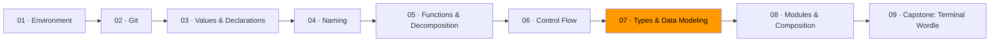

# 07 · Types & Data Modeling



*In Module 06, you learned to write code that flows in a straight line — guard clauses, named conditions, flat paths. Now you'll learn the tool that makes most of those checks unnecessary.*

This is the most important module in the track. Everything else teaches you to write code that humans can read. Types teach you to write code where entire categories of bugs *cannot exist*.

## Make illegal states unrepresentable

Look at this struct:

```go
type Order struct {
    ID          string
    Status      string    // "draft", "confirmed", "shipped", "delivered"
    Address     string    // empty in draft
    TrackingNum string    // empty until shipped
    ShippedAt   time.Time // zero until shipped
    DeliveredAt time.Time // zero until delivered
}
```

How many invalid states can you construct? A "draft" with a tracking number. A "delivered" with no ship date. A status of `"banana"`. Dozens. Every function that touches this struct must check for impossible combinations. You're writing validators, defensive `if` statements, and tests for states that should not exist. The type created work instead of preventing it.

Now look at this:

```go
type DraftOrder struct {
    ID string
}

type ConfirmedOrder struct {
    ID      string
    Address string
}

type ShippedOrder struct {
    ID          string
    Address     string
    TrackingNum string
    ShippedAt   time.Time
}

type DeliveredOrder struct {
    ID          string
    Address     string
    TrackingNum string
    ShippedAt   time.Time
    DeliveredAt time.Time
}
```

A `DraftOrder` cannot have a tracking number — the field doesn't exist. A `DeliveredOrder` always has a ship date — the compiler requires it at construction. Invalid states: zero. The guard clauses from Module 06? Gone. Not refactored, not hidden. Eliminated by the type system.

The state transitions become function signatures:

```go
func Confirm(d DraftOrder, address string) ConfirmedOrder { ... }
func Ship(c ConfirmedOrder, tracking string) ShippedOrder  { ... }
func Deliver(s ShippedOrder) DeliveredOrder                { ... }
```

You cannot ship a draft. You cannot deliver a confirmation. The compiler enforces the business rules.

## Enums with `iota`

Go has no `enum` keyword. It has `iota`, a constant generator that produces a closed set of values from a named type.

```go
type Direction int

const (
    North Direction = iota // 0
    East                   // 1
    South                  // 2
    West                   // 3
)

func (d Direction) String() string {
    return [...]string{"North", "East", "South", "West"}[d]
}
```

`iota` starts at 0 and increments for each constant in the block. The type `Direction` constrains the set — no `"northwest"`, no `-7`, no empty string. The `String()` method makes `fmt.Println(North)` print `"North"` instead of `"0"`.

Remember Module 06's advice to always write a `default` case in switches? With `iota` enums and linters, you can get compile-time guarantees that every case is handled. That's the payoff.

## Errors as values

Go treats errors as ordinary values, not exceptions. The `error` interface is one method:

```go
type error interface {
    Error() string
}
```

A function that can fail returns `error` alongside its result:

```go
func divide(a, b float64) (float64, error) {
    if b == 0 {
        return 0, errors.New("division by zero")
    }
    return a / b, nil
}
```

The caller must handle it. The two-value return makes ignoring the error a conscious act — you have to write `_` to discard it, and that `_` is visible in code review.

Why not exceptions? Exceptions create hidden control flow. A function can fail in ways invisible in its signature. Go's approach makes failure explicit: if a function can fail, you see `error` in the return type. No surprises. Failure is part of the interface, not hidden behind it.

Three kinds of "not the happy path" — don't conflate them:

| Situation | Meaning | Go idiom |
|-----------|---------|----------|
| **Absence** | A value legitimately doesn't exist | Zero value + `bool`, or a pointer |
| **Failure** | An operation went wrong | Return `error` |
| **Invalidity** | Input violates a domain rule | Reject at construction |

A user not found is absence. The database being unreachable is failure. A negative user ID is invalidity. Each demands a different response.

## FP vs OOP — when to use each

This is not a religious debate. Different problems have different shapes.

**Use values and pure functions when** you're computing a result from inputs. Data transforms, no mutation, trivial to test. Module 05's pure vs. impure distinction, applied at scale.

```go
finalPrice := applyDiscount(applyTax(basePrice, 0.08), 15)
```

No state. Same inputs, same output. Functions compose (Module 03's expressions lesson again).

**Use types with methods when** the data has identity — it represents a thing that exists over time. A user, a connection, a game. Construction invariants matter. The state changes *are* the point.

```go
type Game struct {
    board [3][3]rune
    turn  rune
    moves int
}

func NewGame() *Game {
    return &Game{turn: 'X'}
}

func (g *Game) PlaceMarker(row, col int) error {
    if g.board[row][col] != 0 {
        return errors.New("cell occupied")
    }
    g.board[row][col] = g.turn
    g.moves++
    if g.turn == 'X' {
        g.turn = 'O'
    } else {
        g.turn = 'X'
    }
    return nil
}
```

The judgment: is this a **value** you're computing, or a **thing** you're managing? Values get functions. Things get methods. Most real programs use both. The mistake is reaching for one reflexively.

## Domain types over primitives

A common temptation: use `string` for everything. Email addresses, user IDs, statuses. This is primitive obsession — a generic type where a domain type would prevent misuse.

```go
// Dangerous: nothing stops you from swapping arguments
func SendConfirmation(email string, username string) error

// Better: the compiler catches the mixup
type EmailAddress string
type Username string
func SendConfirmation(email EmailAddress, username Username) error
```

Zero runtime cost. Zero readability cost. `SendConfirmation(username, email)` with arguments swapped is now a compile error instead of a production bug.

## Exercises

1. **[Illegal states](exercise-01-illegal-states/)** — model a domain where bad states are impossible to construct
2. **[Errors as values](exercise-02-errors-as-values/)** — handle three kinds of failure without exceptions
3. **[Struct vs. interface](exercise-03-struct-vs-interface/)** — implement a problem both ways and discuss tradeoffs
4. **[FP vs. OOP decision](exercise-04-fp-vs-oop/)** — two problems, two paradigms, explain your choices

## Resources

- [Effective Go — Errors](https://go.dev/doc/effective_go#errors) — Go's canonical error handling conventions
- [Go Blog — "Errors are values"](https://go.dev/blog/errors-are-values) — the blog post that reframes error handling as programming
- [Go Proverbs](https://go-proverbs.github.io/) — principles for Go programmers
- [Rich Hickey — "Simple Made Easy" (Strange Loop 2011)](https://www.infoq.com/presentations/Simple-Made-Easy/) — the distinction between simplicity and familiarity
- Ousterhout, John. *A Philosophy of Software Design* — deep modules, information hiding, defining errors out of existence

*Next: [Module 08 · Modules & Composition](../module-08-modules-and-composition/) — organize types into packages, hide decisions behind boundaries, compose them into programs.*
