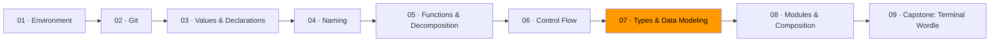

# 07 · Types & Data Modeling



This is the most important module in the track.

Everything you've learned so far — naming, decomposition, control flow — helps you write clearer code. Types help you write *correct* code. The idea is simple: instead of checking for bad states at runtime with `if` statements, design your data so bad states can't exist in the first place.

If your traffic light type can hold the value "purple," you'll write a check for it somewhere. If your traffic light type can *only* be red, yellow, or green, the check is unnecessary. The type system enforces the rule for you.

## Making illegal states unrepresentable

Consider a shipping order. An order can be in one of four states:

1. **Draft** — just created, no address yet
2. **Confirmed** — has a shipping address, no tracking number yet
3. **Shipped** — has a tracking number and ship date
4. **Delivered** — has a delivery date

The naive approach uses one struct with optional fields:

```go
// Bad: every field is always present, most are meaningless
type Order struct {
    ID           string
    Status       string // "draft", "confirmed", "shipped", "delivered"
    Address      string // empty in draft
    TrackingNum  string // empty until shipped
    ShippedAt    time.Time // zero until shipped
    DeliveredAt  time.Time // zero until delivered
}
```

This type allows nonsense: a "draft" order with a tracking number, a "delivered" order with no ship date, a status of "banana." Every function that uses this type has to check for these impossible combinations.

The better approach: one type per state, each carrying only the data that makes sense for that state.

```go
type DraftOrder struct {
    ID string
}

type ConfirmedOrder struct {
    ID      string
    Address string
}

type ShippedOrder struct {
    ID          string
    Address     string
    TrackingNum string
    ShippedAt   time.Time
}

type DeliveredOrder struct {
    ID          string
    Address     string
    TrackingNum string
    ShippedAt   time.Time
    DeliveredAt time.Time
}
```

Now a `DraftOrder` can't have a tracking number. A `DeliveredOrder` always has a ship date. The compiler enforces the business rules. No runtime checks needed.

## Enums with `iota`

Go doesn't have a built-in enum keyword, but `iota` gives you the same thing:

```go
type Direction int

const (
    North Direction = iota
    East
    South
    West
)

func (d Direction) String() string {
    return [...]string{"North", "East", "South", "West"}[d]
}
```

This is a closed set: there are exactly four directions. The `Direction` type carries that constraint. Using `int` or `string` would allow any value.

For more complex enums where each variant carries different data, Go uses interfaces:

```go
type Shape interface {
    Area() float64
    isShape() // unexported method prevents external implementation
}

type Circle struct{ Radius float64 }
type Rectangle struct{ Width, Height float64 }

func (c Circle) Area() float64    { return math.Pi * c.Radius * c.Radius }
func (c Circle) isShape()         {}
func (r Rectangle) Area() float64 { return r.Width * r.Height }
func (r Rectangle) isShape()      {}
```

The unexported `isShape()` method is a trick: only types in this package can implement `Shape`. It's a sealed set — the Go equivalent of a sum type.

## Errors as values

Go treats errors as ordinary values, not exceptions. A function that can fail returns an `error` alongside its result:

```go
func divide(a, b float64) (float64, error) {
    if b == 0 {
        return 0, errors.New("division by zero")
    }
    return a / b, nil
}
```

The caller *must* handle the error — the two-value return makes it impossible to ignore accidentally:

```go
result, err := divide(10, 0)
if err != nil {
    // handle the error
}
// use result
```

This is different from languages that use exceptions (throw/catch). Exceptions create hidden control flow — a function can fail in ways that aren't visible in its signature. Go's approach makes failure explicit: if a function can fail, you see it in the return type.

### Three kinds of "not the happy path"

| Situation | Meaning | Go idiom |
|-----------|---------|----------|
| Absence | A value legitimately doesn't exist | Return a zero value + `bool`, or use a pointer |
| Failure | An operation failed predictably | Return `error` |
| Invalidity | Input violates a domain rule | Return a typed error or reject at construction |

Don't conflate these. A user not found in the database (absence) is different from the database being unreachable (failure) is different from an invalid user ID (invalidity).

## Functional vs. object-oriented: when to use each

This isn't a religious debate. It's a toolbox question. Different problems have different shapes.

**Use data transformations (functional style) when:**
- You're processing a pipeline: input → transform → transform → output
- The data doesn't change over time — you're computing a result from values
- You want to test easily — pure functions with no state are trivial to test

```go
// Functional style: data in, data out
func applyTax(price float64, rate float64) float64 {
    return price * (1 + rate)
}

func applyDiscount(price float64, percent float64) float64 {
    return price * (1 - percent/100)
}

// Compose: pipe data through transformations
finalPrice := applyDiscount(applyTax(basePrice, 0.08), 15)
```

**Use types with methods (object-oriented style) when:**
- The data has identity — it represents a thing that exists over time (a user, a connection, a game)
- Construction invariants are complex enough to warrant a constructor
- Behavior and state are inseparable — the methods need the data, the data needs the methods

```go
// OO style: the game is a thing with state that changes over time
type Game struct {
    board  [3][3]rune
    turn   rune
    moves  int
}

func NewGame() *Game {
    return &Game{turn: 'X'}
}

func (g *Game) PlaceMarker(row, col int) error {
    if g.board[row][col] != 0 {
        return errors.New("cell already occupied")
    }
    g.board[row][col] = g.turn
    g.moves++
    if g.turn == 'X' {
        g.turn = 'O'
    } else {
        g.turn = 'X'
    }
    return nil
}
```

**Most real programs use both.** Pure functions for data transformations, types with methods for entities that have lifecycle. The mistake is reaching for one paradigm reflexively. Ask: is this a *value* I'm computing, or a *thing* I'm managing?

## Exercises

1. **[Illegal states](exercise-01-illegal-states/)** — model a domain where bad states are impossible to construct
2. **[Errors as values](exercise-02-errors-as-values/)** — handle three kinds of failure without exceptions
3. **[Struct vs. interface](exercise-03-struct-vs-interface/)** — implement a problem both ways and discuss tradeoffs
4. **[FP vs. OOP decision](exercise-04-fp-vs-oop/)** — two problems, two paradigms, explain your choices

## Resources

- [Go — Effective Go: Errors](https://go.dev/doc/effective_go#errors) — Go's error handling conventions
- [Go — Frequently Asked Questions: Generics](https://go.dev/doc/faq#generics) — understanding Go's type system design decisions
- [Roadmap.sh — Go: Methods and Interfaces](https://roadmap.sh/golang) — Go-specific type patterns
