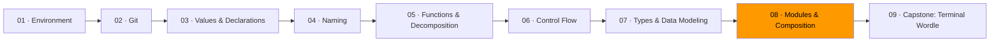

# 08 · Modules & Composition



A module is a boundary. On one side: the callers, who see a simple interface and don't care how it works. On the other side: the implementation, which can be as complex as it needs to be. The boundary protects both parties — callers from complexity they don't need, and the implementation from callers who might misuse internals.

This is the most important idea in software design. The name for it is *information hiding*, and it comes from a 1972 paper by David Parnas that's still the clearest explanation of how to decompose a system. Ousterhout built his entire book around it: a good module is *deep* — a simple interface hiding significant complexity.

## Deep modules vs. shallow modules

Picture a module as a rectangle. The top edge is the interface — everything a caller needs to know to use it. The body is the functionality hidden behind that interface.

```
Deep module:             Shallow module:
┌──────┐                ┌──────────────────────┐
│      │                │                      │
│      │                └──────────────────────┘
│      │
│      │                The interface is almost as
│      │                complex as the implementation.
│      │                It doesn't save you anything.
└──────┘
Narrow interface,
huge depth.
```

**Unix file I/O** is the canonical deep module. Five functions: `open`, `read`, `write`, `seek`, `close`. Behind that simple interface: file systems, disk drivers, permissions, caching, journaling, network file systems. The caller knows none of this. The caller doesn't need to.

**Java's file I/O** is the canonical shallow counterpart. Want to read a file with buffering? Three classes layered on top of each other, each with its own interface to learn. The complexity that should be hidden is pushed onto the caller.

The measure: **how much does a caller need to know to use this module?** Less is better.

## Information hiding in Go

Go makes information hiding structural. Uppercase names are exported (visible outside the package). Lowercase names are unexported (private to the package).

```go
package account

// Account is exported — other packages can use it.
type Account struct {
    owner   string  // unexported — only this package can access
    balance int     // unexported — only this package can access
}

// New is exported — this is the constructor.
func New(owner string, initialDeposit int) (*Account, error) {
    if owner == "" {
        return nil, errors.New("owner name required")
    }
    if initialDeposit < 0 {
        return nil, errors.New("initial deposit must be non-negative")
    }
    return &Account{owner: owner, balance: initialDeposit}, nil
}

// Deposit is exported — callers use this to add money.
func (a *Account) Deposit(amount int) error { ... }

// Balance is exported — callers use this to read the balance.
func (a *Account) Balance() int { return a.balance }
```

The caller can't set `balance` directly. They can't create an `Account` with invalid data. They go through the interface — `New`, `Deposit`, `Balance` — and the module enforces the invariants. No amount of misuse from outside can put the account into a bad state.

## Functional core, imperative shell

The most practical application of module boundaries: separate your pure logic from your I/O.

The **functional core** is the heart of your program — business rules, data transformations, decision logic. It takes values in and returns values out. No printing, no reading files, no network calls. It's pure, testable, and portable.

The **imperative shell** is the boundary layer — the `main` function, the HTTP handler, the CLI parser. It reads input from the outside world, calls the core, and writes output back. It's impure but thin.

```
┌──────────────────────────────────────────┐
│ Imperative shell (I/O, effects)          │
│                                          │
│  Read input → ┌──────────────────┐       │
│               │ Functional core  │       │
│               │ (pure logic)     │       │
│  Write output ← └──────────────────┘      │
│                                          │
└──────────────────────────────────────────┘
```

The capstone (Terminal Wordle) is built exactly this way: the game logic is pure — it takes a guess and returns a result. The terminal rendering is the shell — it reads input and displays output. The game package knows nothing about terminals. The terminal code knows nothing about word matching.

## When to create a package

Go organizes code into packages. A package should represent a coherent concept — not a layer ("models", "utils", "helpers") but a domain ("account", "inventory", "auth").

Create a new package when:
- The code behind it can be understood without reading the rest of the program
- The interface is smaller than the implementation
- The name is a noun that describes a domain concept

Don't create a package just to "organize." A `utils` package is a symptom of not knowing where things belong. If a function doesn't fit in any existing package, that's a design signal — figure out what concept it belongs to and create a package for *that concept*, not for "stuff."

## Exercises

1. **[Information hiding](exercise-01-information-hiding/)** — seal a module by reducing its exported surface to only what callers need
2. **[Deep vs. shallow](exercise-02-deep-vs-shallow/)** — compare two implementations and measure their interface complexity
3. **[Boundary drawing](exercise-03-boundary-drawing/)** — split a program into packages at the natural seams

## Resources

- [Go — How to write Go code](https://go.dev/doc/code) — official guide to packages and modules
- [Go — Effective Go: Package names](https://go.dev/doc/effective_go#package-names) — naming packages well
