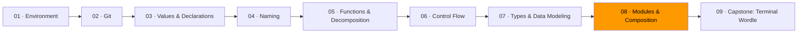

# 08 · Modules & Composition



*In Module 07, you learned to model data so invalid states can't exist. Now you'll learn to draw boundaries around that data — hiding complexity so each piece of your program can be understood on its own.*

Two APIs for a cache. Which one would you rather learn?

```
API A (11 exported names):               API B (4 exported names):
  Cache                                    Cache
  CacheConfig                              New
  CacheOption                              Get
  NewCache                                 Set
  WithTTL
  WithMaxSize
  WithEvictionPolicy
  Get
  Set
  Delete
  Flush
```

API B hides more behind a narrower opening. You learn four things and you're productive. API A demands you understand configuration types, option patterns, and eviction policies before you store a single value. The second cache might do just as much work — it just doesn't make *you* do the work of understanding its internals.

That ratio — power of implementation divided by complexity of interface — is the measure of a good module.

## Deep modules vs. shallow modules

Picture a module as a rectangle. The top edge is the interface (what callers learn). The body is the implementation (what the module does).

```
Deep module:              Shallow module:

┌───────┐                 ┌────────────────────────────┐
│       │                 │                            │
│       │                 └────────────────────────────┘
│       │
│       │                 Wide interface, thin implementation.
│       │                 The caller learns almost as much
│       │                 as the module contains.
│       │
└───────┘

Narrow interface,
deep implementation.
```

**Deep: Unix file I/O.** Five functions — `open`, `read`, `write`, `lseek`, `close`. Behind that: file systems, disk drivers, block caching, permissions, journaling, network file systems. The caller calls `open` and gets a file descriptor. The depth is staggering; the interface is five functions.

**Shallow: a pass-through wrapper.** A `GameService` whose `SubmitGuess` just calls `Game.SubmitGuess` with the same arguments. It adds a name to learn, a type to construct, and a layer to navigate — all to do nothing. If a layer doesn't know something the caller doesn't, the layer shouldn't exist.

In Go, the concrete unit is the **package**. Exported names (uppercase) are the interface. Unexported names (lowercase) are the implementation. The compiler enforces the boundary.

## Information hiding

A design decision — the file format, the scoring algorithm, the storage layout — lives in exactly one module. Change that decision, and only that module changes. The rest of the system is insulated.

```go
package game

// Check is exported — this is the interface.
func Check(guess, answer string) Feedback {
    return score(guess, answer)
}

// score is unexported — the algorithm is hidden.
// Callers can't call it, depend on it, or break if it changes.
func score(guess, answer string) Feedback {
    // ... scoring logic ...
}
```

If the scoring algorithm leaks into the UI layer — say the terminal code knows to check exact matches before misplaced ones — then changing the algorithm requires changing two packages. The boundary failed. The modules are coupled by shared knowledge that should have been private.

**Temporal decomposition** is the most common way beginners draw wrong boundaries. "First we read, then we process, then we write" — so three packages: `reader`, `processor`, `writer`. But the reader and writer both know the file format. That knowledge now lives in two places. The boundary was drawn along the timeline instead of along lines of knowledge. Put them in one package: `config.Load`, `config.Save`.

## Functional core / imperative shell

Everything above converges on one architecture: separate pure logic from I/O. Module 05's pure vs. impure distinction, applied at the package level.

The **functional core** is the deepest module. Business rules, data transforms, scoring algorithms. Values in, values out. No printing, no file reading. Pure, testable, portable.

The **imperative shell** is thin. It reads from the outside world, calls the core, writes results back. Impure but simple. Almost no logic of its own.

In the Wordle capstone (Module 09), this looks like:

- **`game/`** — the functional core. Given a guess string, returns a `Feedback` struct. Knows nothing about terminals. Module 07's types (illegal states unrepresentable) enforce the rules.
- **`ui/`** — the imperative shell. Reads stdin, calls `game.Check`, renders output. Knows nothing about scoring.
- **`main.go`** — wires them together. Three lines of real code.

Change the scoring algorithm, `ui/` doesn't change. Swap the terminal for a web frontend, `game/` doesn't change. That's information hiding applied end-to-end.

## When to create a package

A package represents a **domain concept**, not an architectural layer.

**Bad package names** — these aren't concepts, they're junk drawers: `utils`, `helpers`, `models`, `common`. The types in `models` are actually about accounts, orders, games — put them there.

**Good package signs:**
- You can explain it in one sentence **without "and"** (Module 04's naming lesson — if the name is hard, the design is muddled)
- The name is a noun: `account`, `game`, `auth`, `inventory`
- More is unexported than exported
- Callers don't need to read the source to use it — the exported names tell the story

Create a package when you have a design decision to hide. If there's no decision to hide, there's no boundary to draw.

## Exercises

1. **[Information hiding](exercise-01-information-hiding/)** — seal a module by reducing its exported surface to only what callers need
2. **[Deep vs. shallow](exercise-02-deep-vs-shallow/)** — compare two implementations and measure their interface complexity
3. **[Boundary drawing](exercise-03-boundary-drawing/)** — split a program into packages at the natural seams

## Resources

- [Go — How to Write Go Code](https://go.dev/doc/code) — official guide to packages and modules
- [Go — Effective Go: Package names](https://go.dev/doc/effective_go#package-names) — naming packages well
- [Parnas — "On the Criteria to Be Used in Decomposing Systems into Modules" (1972)](https://dl.acm.org/doi/10.1145/361598.361623) — the origin of information hiding
- Ousterhout, John. *A Philosophy of Software Design* — chapters 4-8 on deep modules and pulling complexity downward
- [MIT 6.033 — Computer System Engineering](https://ocw.mit.edu/courses/6-033-computer-system-engineering-spring-2018/) — modularity and abstraction at the systems level
- [Go Proverbs](https://go-proverbs.github.io/) — "The bigger the interface, the weaker the abstraction"

*Next: [Module 09 · Capstone: Terminal Wordle](../module-09-capstone-wordle/) — build a complete game. Every boundary decision you make will test what you learned here.*
