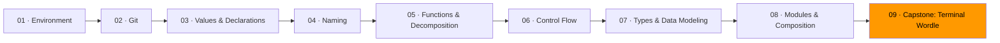

# 09 · Capstone: Terminal Wordle



Time to build something real.

You're making a terminal version of Wordle — the word-guessing game. The computer picks a five-letter word. You get six tries. After each guess, the game tells you which letters are correct (right letter, right place), which are misplaced (right letter, wrong place), and which aren't in the word at all.

This project exercises everything from Modules 01–08:

| Module | How it shows up in Wordle |
|--------|--------------------------|
| 01 Environment | You run it from the terminal with `go run .` |
| 02 Git | You work on a branch and commit as you go |
| 03 Values & Declarations | Word lists, guess tracking, game constants |
| 04 Naming | `evaluateGuess`, `letterResult`, `isValidWord` — names carry meaning |
| 05 Functions & Decomposition | Small pure functions for game logic, side effects only in the UI |
| 06 Control Flow | Guard clauses for invalid input, clean game loop |
| 07 Types & Data Modeling | `LetterResult` enum (correct/misplaced/absent), `GameState` types that make wrong states impossible |
| 08 Modules & Composition | Game logic in `game/`, terminal I/O in `ui/` — they don't know about each other |

## Architecture

```
exercise-01-wordle/
  stub/
    main.go          ← composition: create game, run loop
    game/
      game.go        ← types, game state, evaluation logic
      words.go       ← word list
    ui/
      terminal.go    ← read input, display board
```

The `game` package is pure. It takes a guess and returns a result. It doesn't know what a terminal is. It doesn't print anything. It doesn't read input.

The `ui` package handles all terminal interaction. It reads guesses from stdin, formats the board with colors, and shows win/lose messages.

`main.go` ties them together: pick a word, create the game, loop until done.

## How to work through this

The stub gives you the type definitions and function signatures. The function bodies are empty (or have TODO comments). Your job is to fill them in.

Work in this order. Commit after each checkpoint.

**Checkpoint 1: Basic evaluation.** Implement `EvaluateGuess` in `game/game.go` for words with no duplicate letters. Test it by calling `EvaluateGuess("baker", "crane")` in a throwaway `main` and printing the result. Get this working first.

**Checkpoint 2: Duplicate letters.** Update `EvaluateGuess` to handle words with repeated letters (like "hello" or "apple"). The two-pass algorithm in the stub comments explains how. Test with `EvaluateGuess("apple", "paper")` and verify the result matches the examples.

**Checkpoint 3: Word list and game state.** Implement `IsValidWord` and `RandomWord` in `game/words.go`. Implement `New` and `MakeGuess` in `game/game.go`. You now have a working game engine with no UI.

**Checkpoint 4: Terminal UI.** Implement `ReadGuess`, `DisplayTurn`, `DisplayWin`, `DisplayLoss`, and `DisplayWelcome` in `ui/terminal.go`. The game is now playable.

**Stretch: Polish.** Add the keyboard display showing which letters you've tried. Add color-coded tiles. Make it look good. This is optional — a working game with plain text output is a complete capstone.

## Git workflow

Create a branch for this project:

```
git switch -c wordle-capstone
```

Commit after each step. When you're done, open a PR.

## Exercise

1. **[Wordle](exercise-01-wordle/)** — build the complete game from the stub

## Resources

- [Wordle — the original game](https://www.nytimes.com/games/wordle/) — play it first if you haven't
