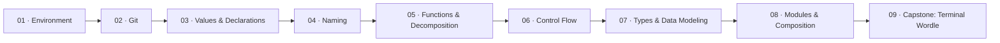

# Getting Started — TypeScript variant

You chose JavaScript and TypeScript. Good pick. You'll start with plain JavaScript — a language that runs everywhere, forgives fast, and teaches you how programs actually work. Then at Module 07, you'll pick up TypeScript and never look back. TypeScript adds a type system that catches bugs before your code runs. What you learn here transfers directly to the Frontend track.

## Before you start

You need a computer with internet access. That's it. Module 01 walks you through installing everything else.

## The roadmap

## Modules

| # | Module | What clicks |
|---|--------|------------|
| 01 | [Environment](module-01-environment/) | Your machine is ready and you know where everything lives |
| 02 | [Git](module-02-git/) | You can track changes, work in parallel, and fix your mistakes |
| 03 | [Values & Declarations](module-03-values-and-declarations/) | You know what data is — variables, constants, expressions, statements |
| 04 | [Naming](module-04-naming/) | The hardest part of programming is choosing the right word |
| 05 | [Functions & Decomposition](module-05-functions-and-decomposition/) | You can break any problem into pieces and know what a side effect is |
| 06 | [Control Flow](module-06-control-flow/) | Flat code beats clever code, and you know why |
| 07 | [Types & Data Modeling](module-07-types-and-data-modeling/) | You can make bad states impossible, and you know when FP vs OOP fits |
| 08 | [Modules & Composition](module-08-modules-and-composition/) | You can organize files, draw boundaries, and hide complexity |
| 09 | [Capstone: Terminal Wordle](module-09-capstone-wordle/) | You can build a real thing from scratch using everything above |

## The language progression

Modules 01–06 use **plain JavaScript**. No types, no build step, no ceremony. You write `.js` files, run them with `bun`, and focus on the concepts.

Module 07 introduces **TypeScript**. From that point forward, everything is TypeScript. The transition is deliberate — you learn what JavaScript gives you, then you see what it's missing, then TypeScript fills the gap.

## Language reference

**[JS/TS Reference](js-ts-reference.md)** — keep this open while you work. Variables, types, scope, data structures, methods, iteration patterns, and TypeScript-specific features. Everything you need to write JS and TS, in one scannable page.

## How each module works

Every module has a README that explains the concept with examples. Below that are exercises — small problems you solve by editing files in a `stub/` folder. A `solution/` folder has the completed version if you get stuck.

Read the README first. Do the exercises. Check the solution only after you've tried. The struggle is where the learning happens.

## After this track

You'll be ready for:
- **[Frontend](../../frontend/)** (requires this variant) — HTML, CSS, React, design thinking
- **[Systems Engineering](../../systems-engineering/)** (either variant) — scale, distributed systems, system design
