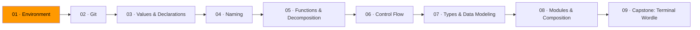
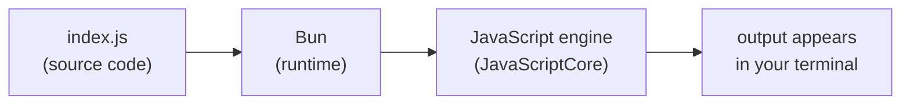

# 01 · Environment

*This is where it starts. Before you write code, you need a machine that can run it.*

You install Bun. You install VS Code. You type `bun run index.js` and your program runs. That covers 90% of your day. But when something breaks — and it will — the fix is almost always: the tool isn't installed, or your shell can't find it. Understanding the pipeline saves you hours of confused Googling.

## What happens when you type `bun run index.js`

1. The shell hands `bun run index.js` to the `bun` program.
2. Bun reads the file, compiles the JavaScript to machine code using JavaScriptCore (WebKit's JS engine), and executes it.
3. Output flows to your terminal.

There's no separate "compile" step like Go or Rust. Bun reads your source file and runs it directly. But compilation still happens — it's just invisible and instant. This is interpreted-language ergonomics with compiled-language speed. Bun is significantly faster than Node.js because it uses a faster engine and is written in Zig instead of C++.

## Three things to understand

**The shell** reads your commands, finds programs, runs them. Five commands cover daily use:

| Command | What it does |
|---------|-------------|
| `ls` | List files in the current directory |
| `cd` | Change directory |
| `mkdir` | Create a directory |
| `cat` | Print a file's contents |
| `bun run index.js` | Run the JavaScript file here |

**The PATH** is a list of directories your shell searches when you type a command. If `bun` isn't in one of those directories, you get `command not found`. Every "installation" is really two things: putting a binary on disk and making sure its location is in `PATH`. When an install "doesn't work," the problem is almost always `PATH`.

**The editor** is VS Code. Install the ESLint and Prettier extensions. Later, when you add TypeScript in Module 07, VS Code's built-in TypeScript language server gives you errors, formatting, and autocomplete for free. The editor and the language server are separate programs. Small tools, clear boundaries.

## Bun — one tool, three jobs

Bun replaces three things that used to be separate tools in the JavaScript ecosystem:

| Command | What it does |
|---------|-------------|
| `bun run index.js` | Run a JavaScript or TypeScript file |
| `bun install` | Install packages (like `npm install`, but faster) |
| `bun test` | Run tests (built-in test runner) |
| `bun init` | Initialize a new project with `package.json` |

Runtime, package manager, test runner — one binary. No `npm`, no `npx`, no `jest`, no `ts-node`. Just `bun`.

## Exercises

1. **[Toolbox check](exercise-01-toolbox-check/)** — install everything and verify it works
2. **[First push](exercise-02-first-push/)** — create a repo, write a program, push it to GitHub

## Resources

- [MIT — The Missing Semester: The Shell](https://missing.csail.mit.edu/2020/course-shell/) — the lecture this module draws from
- [Bun — Installation](https://bun.sh/docs/installation) — official installation guide
- [Bun — Quickstart](https://bun.sh/docs/quickstart) — first steps with Bun

**[Continue to Module 02 · Git →](../module-02-git/)**
