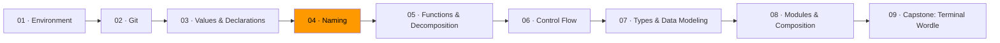

# 04 · Naming



*In Module 03, you learned what data is and how to bind names to it. Now you'll learn the skill that determines whether anyone — including future you — can read your code.*

Read this function. What does it do?

```js
const proc = (d, x) => {
  const r = [];
  for (const v of d) {
    if (v.length > x) {
      const t = v[0].toUpperCase() + v.slice(1);
      r.push(t);
    }
  }
  return r;
};
```

Now read this one:

```js
const filterAndCapitalize = (words, minLength) => {
  const result = [];
  for (const word of words) {
    if (word.length > minLength) {
      const capitalized = word[0].toUpperCase() + word.slice(1);
      result.push(capitalized);
    }
  }
  return result;
};
```

Same code. Same logic. But the second one you can read without reverse-engineering. That's the entire lesson. Naming is not a style preference — it's a correctness concern. A misleading name hides bugs.

## The distance rule

The further a name travels from where it's declared, the more descriptive it needs to be.

| Scope | What works | Example |
|-------|-----------|---------|
| Loop body (3 lines) | Single letter | `i`, `v`, `r` |
| Inside one function | Short, contextual | `count`, `err`, `buf` |
| Module-level, not exported | Descriptive | `activeUsers`, `retryLimit` |
| Exported (public API) | Fully qualified | `parseMarkdownToHTML`, `InvalidInputError` |

JavaScript convention is `camelCase` for variables and functions, `PascalCase` for classes and types. Unlike Go, JavaScript has no uppercase-means-exported convention — visibility is controlled by `export` (Module 08). But the distance rule still holds: the wider the scope, the more the name must carry.

## Part-of-speech conventions

Code reads like prose when names follow consistent grammar.

**Types/classes are nouns.** `Student`, `Connection`, `Order`.
**Functions are verbs.** `parse`, `close`, `validate`.
**Booleans are predicates.** `isActive`, `hasPermission`, `canRetry` — not `status` or `flag`.
**Collections are plural.** `users`, `scores`, `items`.

When code follows these patterns, it reads like sentences:

```js
if (isActive(user)) {
  const orders = fetchOrders(user.id);
  const total = calculateTotal(orders);
  sendReceipt(user.email, total);
}
```

You can follow this without reading a single function body. The names carry the meaning.

## Naming difficulty is a design signal

If you can't name it, the design is muddled. The classic tell is "And" in a function name:

```js
const validateAndSaveUser = (user) => { ... };
```

"And" reveals two responsibilities. Split them:

```js
const validate = (user) => { ... };
const save = (user) => { ... };
```

The awkward name was the symptom. The muddled design was the disease. When the design is right, the name becomes obvious. You'll see this again in Module 05 when we talk about decomposition — naming difficulty tells you where to cut.

## Consistency

Use the same name for the same concept everywhere. If you use `block` here and `chunk` there and `segment` somewhere else, the reader has to verify whether the name difference signals a meaning difference. It usually doesn't. But they can't know without checking.

Avoid redundancy between a module's name and its exports:

```js
// Bad                          // Good
import { userService }          import { service }
  from "./user/userService";      from "./user/service";

import { createWidget }         import { create }
  from "./widget/createWidget";   from "./widget";
```

The module path already provides context. `user/service.create()` reads better than `user/userService.createWidget()`.

## Exercises

1. **[Name audit](exercise-01-name-audit/)** — rename every variable in a program where everything is named `x`, `temp`, or `data`
2. **[The distance rule](exercise-02-distance-rule/)** — evaluate and fix names based on their scope distance
3. **[Part of speech as design](exercise-03-part-of-speech/)** — apply naming conventions to make code read like prose

## Resources

- [MDN — JavaScript naming conventions](https://developer.mozilla.org/en-US/docs/MDN/Writing_guidelines/Writing_style_guide/Code_style_guide/JavaScript) — standard JS conventions
- [Google JavaScript Style Guide](https://google.github.io/styleguide/jsguide.html#naming-rules-by-identifier-type) — Google's naming conventions
- Ousterhout, John. *A Philosophy of Software Design*, 2nd ed. — Chapter 14: Choosing Names
- McConnell, Steve. *Code Complete*, 2nd ed. — Chapter 11: The Power of Variable Names
