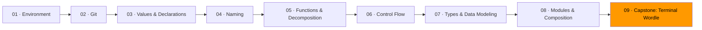

# 09 · Capstone: Terminal Wordle



Time to build something real.

You're making a terminal version of Wordle — the word-guessing game. The computer picks a five-letter word. You get six tries. After each guess, the game tells you which letters are correct (right letter, right place), which are misplaced (right letter, wrong place), and which aren't in the word at all.

This project exercises everything from Modules 01-08:

| Module | How it shows up in Wordle |
|--------|--------------------------|
| 01 Environment | You run it from the terminal with `bun run index.ts` |
| 02 Git | You work on a branch and commit as you go |
| 03 Values & Declarations | Word lists, guess tracking, game constants |
| 04 Naming | `evaluateGuess`, `LetterResult`, `isValidWord` — names carry meaning |
| 05 Functions & Decomposition | Small pure functions for game logic, side effects only in the UI |
| 06 Control Flow | Guard clauses for invalid input, clean game loop |
| 07 Types & Data Modeling | `LetterResult` discriminated union (correct/misplaced/absent), game state types that make wrong states impossible |
| 08 Modules & Composition | Game logic in `game/`, terminal I/O in `ui/` — they don't know about each other |

## Architecture

```
exercise-01-wordle/
  stub/
    index.ts           ← composition: create game, run loop
    game/
      evaluate.ts      ← types, evaluation logic
      words.ts         ← word list, validation
    ui/
      terminal.ts      ← read input, display board
```

The `game` directory is pure. It takes a guess and returns a result. It doesn't know what a terminal is. It doesn't print anything. It doesn't read input.

The `ui` directory handles all terminal interaction. It reads guesses from stdin, formats the board with colors, and shows win/lose messages.

`index.ts` ties them together: pick a word, create the game, loop until done.

## How to work through this

The stub gives you the type definitions and function signatures. The function bodies are empty (or have TODO comments). Your job is to fill them in.

Work in this order:

1. **Start with `game/evaluate.ts`** — implement `evaluateGuess` first. This is the heart of the game. Given a target word and a guess, return an array of `LetterResult` values. Get this right and everything else falls into place.

2. **Then `game/words.ts`** — implement `isValidWord` and `randomWord`. The word list is already there.

3. **Then `ui/terminal.ts`** — implement `readGuess` and `displayResult`. Make it look good in the terminal.

4. **Finally `index.ts`** — wire it all together into a game loop.

Test as you go. After step 1, you can write a quick script that calls `evaluateGuess` with hardcoded values and prints the result:

```ts
import { evaluateGuess } from "./game/evaluate";
console.log(evaluateGuess("crane", "crate"));
```

Run it with `bun run test-evaluate.ts`. Delete the script when you're done.

## Git workflow

Create a branch for this project:

```
git switch -c wordle-capstone
```

Commit after each step. When you're done, open a PR.

## Exercise

1. **[Wordle](exercise-01-wordle/)** — build the complete game from the stub

## Resources

- [Wordle — the original game](https://www.nytimes.com/games/wordle/) — play it first if you haven't
- [Bun — Console input](https://bun.sh/docs/api/console) — reading from stdin in Bun
