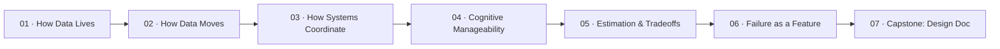

# Systems Engineering

How to think about software that runs at scale, breaks in interesting ways, and needs to be understood by people who didn't write it.

**Prerequisite:** [Getting Started](../getting-started/) (either variant)

This track is different from the others. There's less coding and more thinking. You'll read, diagram, estimate, and analyze. The capstone is a document, not an application.

## Why this track exists

Anyone can build a feature. The hard part is building systems that don't collapse under their own weight — systems where you can change one thing without understanding everything, where failures degrade gracefully instead of catastrophically, and where the next person can figure out what's going on without calling you.

That kind of thinking doesn't come from learning another framework. It comes from understanding how data lives, how it moves, how systems coordinate, and what happens when things break.

## The roadmap

## Module overview

| # | Module | What clicks |
|---|--------|------------|
| 01 | How Data Lives | The storage choice shapes everything above it |
| 02 | How Data Moves | Networks are unreliable, slow, and the fundamental constraint of distributed systems |
| 03 | How Systems Coordinate | Consensus is the hardest problem in computing. Every distributed system is a negotiation. |
| 04 | Cognitive Manageability | The enemy is not slow code. The enemy is code you can't hold in your head. |
| 05 | Estimation & Tradeoffs | Back-of-envelope math tells you which problems are real and which are imaginary |
| 06 | Failure as a Feature | Systems don't fail. Parts of systems fail. Good design assumes this from the start. |
| 07 | Capstone: System Design Document | You can reason about a real system on paper before writing a single line of code |

## Capstone: System design document

Pick one of three prompts — hotel booking, ride-sharing, or a notification service — and produce a complete design document. No code.

The deliverable is a markdown file with Mermaid diagrams covering:

- Functional and non-functional requirements
- Data model with storage choice justification
- API design
- High-level architecture diagram
- Scaling strategy
- Failure modes and what happens when each one triggers

You present your design to the group and defend your choices. This is what senior engineers actually do — design on paper before they build.

## Resources

**Books** (referenced throughout, not required upfront)
- *Designing Data-Intensive Applications* — Martin Kleppmann. The primary text for this track. If you read one technical book in your career, this is the one.
- *A Philosophy of Software Design* — John Ousterhout. Especially chapters 2–5 on complexity, deep modules, and information hiding.

**Online**
- [MIT 6.033 — Computer System Engineering](https://web.mit.edu/6.033/www/) — MIT's systems course: OS, networking, distributed systems, security
- [ByteByteGo — System Design Interview](https://bytebytego.com/) — chapters 2 (Scale from Zero), 3 (Estimation), 4 (Framework), 6 (Consistent Hashing), 7 (Key-Value Store), 20 (Message Queues)
- [Roadmap.sh — System Design](https://roadmap.sh/system-design) — the broad landscape of system design topics
- [Roadmap.sh — Software Design & Architecture](https://roadmap.sh/software-design-architecture) — patterns and principles

**Latency numbers worth memorizing**

| Operation | Time |
|-----------|------|
| L1 cache reference | 0.5 ns |
| L2 cache reference | 7 ns |
| RAM reference | 100 ns |
| SSD random read | 16 µs |
| Network round-trip (same datacenter) | 500 µs |
| SSD sequential read (1 MB) | 1 ms |
| Disk seek | 10 ms |
| Network round-trip (cross-continent) | 150 ms |

These numbers shape every design decision in distributed systems. When someone says "just add a cache," these numbers tell you whether that actually helps.
